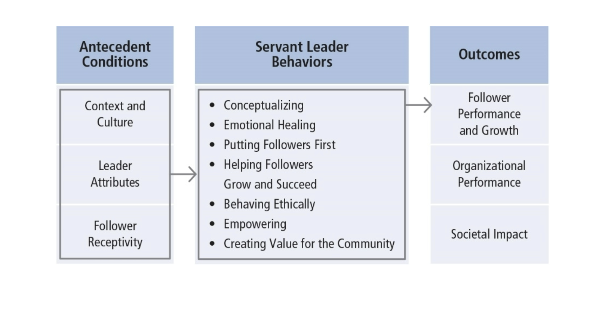

# Servant Leadership

Servant Leadership is a paradox: both service and influence. Most scholarship has been prescriptive, until recently. The past 10 years have clarified the concept and its assumptions. It focuses on leadership from the point of view of the leader and his/her behaviors. Servant leaders put followers first.

## Table of Contents

- [Servant Leadership Defined](#Servant-Leadership-Defined)
- [Historical Basis of Servant Leadership ](#Historical-Basis-of-Servant-Leadership)
- [10 Characteristics of a Servant Leader](#10-Characteristics-of-a-Servant-Leader)
- [Building a Theory about Servant Leadership](#Building-a-Theory-about-Servant-Leadership)
- [Model of Servant Leadership](#Model-of-Servant-Leadership)
  - [Antecedent Conditions](#Antecedent-Conditions)
  - [Servant Leader Behaviors](#Servant-Leader-Behaviors)
  - [Outcomes](#Outcomes)
- [How Does SL Work?](#How-Does-SL-Work?)
- [Strengths](#Strengths)
- [Criticisms](#Criticisms)
- [Application](#Application)

## Servant Leadership Defined

> "Servant leadership begins with the natural feeling that one wants to serve, to serve first. Then conscious choice brings one to aspire to lead. . . . The difference manifests itself in the care taken by the servant--first to make sure that other people’s highest priority needs are being served. The best test . . . is: do those served grow as persons; do they, while being served, become healthier, wiser, freer, more autonomous, more likely themselves to become a servant? And, what is the effect on the least privileged in society; will they benefit, or, at least, will they not be further deprived?”

_Sometimes treated as a trait, but viewed as a behavior in this chapter_

## Historical Basis of Servant Leadership

Greenleaf Center for Servant Leadership first put forth the idea. It began by advocating for building consensus in groups rather than using coercive leadership. They were inspired by Hesse’s novel, Journey to the East, where the travelers discovered the true leader of their group was the servant. Leaders have a social responsibility for the “have-nots”. Leaders shift authority to those who are being led.

## 10 Characteristics of a Servant Leader

1. **Listening:** acknowledging the viewpoint of followers and validating these perspectives.
2. **Empathy:** “standing in the shoes” of another person and attempting to see the world from that person’s point of view.
3. **Healing:** in helping followers become whole, servant leaders are themselves healed.
4. **Awareness:** understanding oneself and the impact one has on others.
5. **Persuasion:** creates change through gentle, nonjudgmental argument.
6. **Conceptualization:** the ability to be a visionary for an organization.
7. **Foresight:** the ability to predict what is coming based on what is occurring in the present and what has happened in the past.
8. **Stewardship:** carefully managing the people and organization one has been given to lead. Holding the organization in trust for the greater good of society.
9. **Commitment to the Growth of People:** treating each follower as a unique person with intrinsic value beyond what he/she contributes to the organization.
10. **Building Community:** allowing followers to identify with something greater than themselves that they value.

## Building a Theory about Servant Leadership

Greenleaf’s leadership approach--loosely defined characteristics and normative principles. Servant leadership adopted as guiding philosophy in many organizations. Recent models of SL developed using multiple variables.

## Model of Servant Leadership

### Antecedent Conditions

- Context and culture
  - Organizational context
  - Dimensions of culture (e.g., power distance)
- Leader attributes
  - Traits interact with ability to engage in servant leadership (moral development, emotional intelligence, agreeableness, humility)
- Follower receptivity
  - Some subordinates do not want to work with servant leaders
  - When matched with followers who desire it, servant leadership has a positive impact on performance and organizational citizenship behavior

### Servant Leader Behaviors

- Conceptualizing
  - Thorough understanding of the organization
  - For example, senior nursing supervisor in emergency room
- Emotional healing
  - Recognizing others’ problems and taking the time to address them
  - For example, Hospice priest on Chicago’s south side
- Putting followers first
  - For example, widely published health education professor
- Helping followers grow and succeed
  - Knowing followers’ professional or personal goals
  - For example, high school music teacher
- Behaving ethically
  - Doing the right thing in the right way
  - For example, CEO and leaked document from rival company
- Empowering
  - Allowing followers the freedom to be independent, make decisions on their own, and be self-sufficient
  - For example, college professor with TAs
- Creating value for the community
  - Intentionally giving back to the community
  - Encouraging followers to volunteer for community service
  - For example, principal of alternative high school

### Outcomes

- Follower performance and growth
  - Recognizing followers’ contributions and helping them realize their human potential
  - Favorable impact on subordinate in-role performance (identification with organization, adaptability, proactivity, service climate, reduced turnover, organizational citizenship)
  - Followers themselves may become servant leaders
- Organizational performance
  - Positive relationship between servant leadership and OCB
  - Team effectiveness enhanced by increasing members’ shared confidence that they could be effective
- Societal impact
  - For example, Mother Teresa and Sisters of Charity
  - For example, Southwest Airlines

## How Does SL Work?

SL is different from many other leadership theories. It is concerned with putting followers first and the outcomes that are likely to emerge. It works best when leaders are altruistic and have a strong motivation to help others. It is important for followers to be receptive to this style of leadership. SL results in community and societal change.

## Strengths

SL makes altruism the central component of the leadership process. It provides a counterintuitive approach to the use of influence. Leaders should share control. SL is not a panacea. It may not be effective when subordinates are not open to being guided, supported, and empowered. Research has resulted in a sound measure of SL--the SLQ.

## Criticisms

Because the name appears contradictory, SL may be seen as whimsical, or not really "leadership." Researchers are unable to reach consensus on a common definition or theoretical framework for SL. The prescriptive overtone suggests that good leaders "put others first," which conflicts with other principles of leadership such as directing, concern for production, and so on. It can also sound moralistic, which may deter some researchers. Conceptualizing is not unique to servant leaders. It is unclear why it is included in this model.

## Application

SL can be applied at all levels of management and in all types of organizations. It has been used extensively in a variety of organizations for more than 30 years. Organizations should be careful to select employees who (a) are interested in building long-term relationships with followers and (b) have strong ethics. SL is taught at many colleges and universities and is used by numerous independent coaches, trainers, and consultants.
