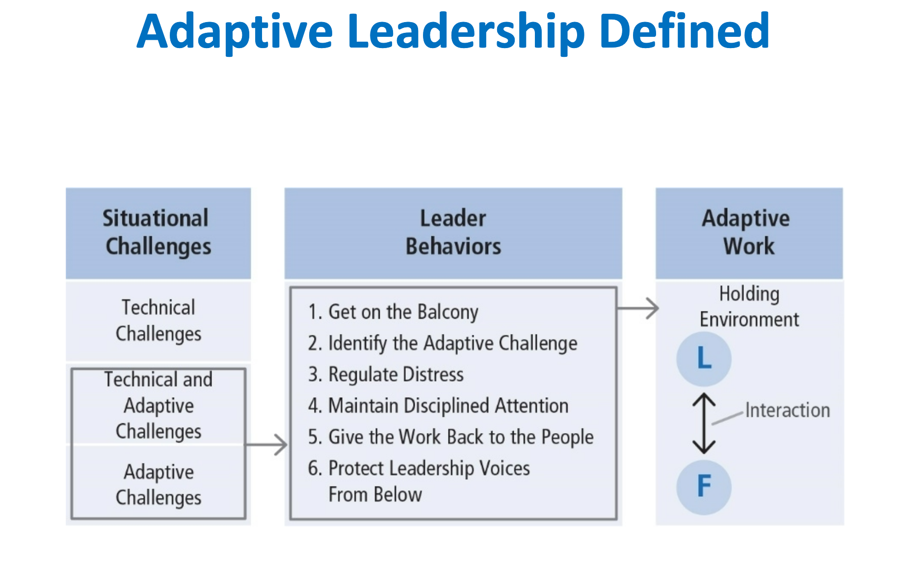

# Adaptive Leadership

## Table of Contents

- [Description](#Description)
- [Incorporates Four Different Viewpoints](#Incorporates-Four-Different-Viewpoints)
- [Subset of Complexity Leadership Theory](#Subset-of-Complexity-Leadership-Theory)
- [Model of Adaptive Leadership](#Model-of-Adaptive-Leadership)
  - [Situational Challenges](#Situational-Challenges)
  - [Leader Behaviors](#Leader-Behaviors)
  - [Adaptive Challenges](#Adaptive-Challenges)
  - [Four Archetypes of Adaptive Change](#Four-Archetypes-of-Adaptive-Change)
  - [Maintain Disciplined Attention](#Maintain-Disciplined-Attention)
- [Adaptive Work](#Adaptive-Work)
- [How Does Adaptive Leadership Work?](How-Does-Adaptive-Leadership-Work?)
- [Strengths](#Strengths)
- [Criticisms](#Criticisms)
- [Application](#Application)

## Description

Adaptive Leadership focuses on the adaptations required of people in response to changing environments. It stresses the activities of the leader in relation to the work of followers in the contexts in which they find themselves. It encourages effective change across multiple levels: self, organizational, community, and societal. The framework was developed largely by Heifetz and associates.

> The practice of mobilizing people to tackle tough challenges and thrive.

Adaptive Leaders:

1. Mobilize
2. Motivate
3. Organize
4. Orient
5. Focus the attention of others

## Incorporates Four Different Viewpoints

- **Systems Perspective**: Problems are complex with interconnected parts
- **Biological Perspective**: People develop and evolve by having to adapt to internal cues and the external environment
- **Service Orientation**: Leadership serves people by diagnosing their problems and prescribing possible solutions
- **Psychotherapy Perspective**: People adapt successfully when they face problems directly, distinguish between fantasy and reality, resolve internal conflicts, and learn new attitudes and behaviors

## Subset of Complexity Leadership Theory

21st century organizations have knowledge and information as core commodities rather than production of goods. This theory includes administrative, adaptive, and enabling leadership. It focuses on strategies that encourage learning, creativity, and adaptation in complex organizations.

## Model of Adaptive Leadership

### Situational Challenges

1. **Technical**: Problems that are clearly defined with known solutions that can be implemented through existing organizational procedures.
   - **Example**: Issues with newly adopted software at accounting firm. Manager has authority to address the problem, contact the software company, and have program modified to meet accountants’ needs.
2. **Technical and Adaptive**: Challenges are clearly defined but do not have straightforward solutions. Leader and followers both tackle problem.
   - **Example**: Hospital wants to change from traditional approach to care to a patient-centered culture. Administration can offer training on how to involve patients in their own care. Medical staff , patients, and families need to accept the change and learn how to implement it.
3. **Adaptive**: Problems that are not clear-cut or easy to identify.
   - **Example**: Hospice care and uncertainty for patients and families about how and when the patient will die. Many questions about the dying process, what the loss means, how to prepare for it and cope with it

### Leader Behaviors

1. **Get on the Balcony**: Stepping out of the fray and finding perspective in the midst of a challenging situation, while still staying connected. Moving back and forth as participant and observer.
2. **Identify Adaptive Challenges**: Analyzing and diagnosing challenges. Distinguishing between technical and adaptive challenges.
3. **Regulate Distress**: Helping others recognize the need for change but not become overwhelmed. Monitoring stress and keeping it within a productive range.
   1. Create a holding environment
   2. Provide direction, protection, orientation, conflict management, and productive norms
   3. Regulate personal distress
4. **Maintain Disciplined Attention**: Encouraging people to focus on the tough work they need to do. Helping people address change and not avoid it. Avoidance = ignoring the problem, blaming the problem on authority or coworkers, attacking those who want to address the problem, pretending the problem doesn’t exist, and working hard in areas unrelated to the problem
5. **Give the Work Back to the People**: Too much leadership and authority can be debilitating, decrease people’s confidence to solve problems on their own, and suppress their creative capacities. Leaders need to be attentive to when they should drop back and let the people do the work that they need to do.
6. **Protect Leadership Voices from Below**: Being open to the ideas of people who may be at the fringe, marginalized, or even deviant in the group or organization.

### Adaptive Challenges

Use adaptive leadership behaviors for adaptive challenges and technical leadership for technical challenges.

Technical means it can be fixed with leader’s own expertise and authority whereas adaptive is value laden and stirs up people’s emotions.

### Four Archetypes of Adaptive Change

1. **Gap between espoused values and behavior**: When an organization espouses values that it doesn’t in reality support by its actions. For example, claiming to be family-friendly but not providing flextime.
2. **Competing commitments**: When an organization has numerous commitments and some conflict with each other. For example, wanting to expand services but cutting staff positions at the same time.
3. **Speaking the unspeakable**: When there are ideas or unpopular ideas or conflicting perspectives that people don’t dare to address. For example,people afraid to discuss the failing skills of an aged, but likable company owner.
4. **Work avoidance**: Where people avoid addressing difficult issues by staying in their comfort zones or by using diversion. For example,refusing to confront a skilled employee whose performance is slacking because he feels the company suffers from institutional racism.

## Adaptive Work

- The process toward which adaptive leaders direct their work.
- Grows out of the communication between leaders and followers but is primarily the work of followers.
- Adaptive work is conducted in the holding environment.
- Followers are not submissive to leaders; they are the ones doing adaptive work.

## How Does Adaptive Leadership Work?

- Focus is on engaging individuals to do adaptive work.
- Leaders support followers during changes in the environment.
- Leader steps back from situation to gain fresh perspective.
- Leader decides whether challenges are technical or adaptive.
- If technical, leader uses authority and expertise to solve.
- If adaptive, leader uses several prescribed behaviors to move the adaptive process forward.

## Strengths

- In contrast to other leadership theories, AL takes a process approach; leadership is a complex transaction between leaders and followers.
- AL is follower centered. Adaptive leaders mobilize people to engage in adaptive work.
- Helps followers deal with conflicting values that emerge in changing work environments.
- Prescribes useful leadership behaviors.
- Contributes concept of a “holding environment” as an integral part of the leadership process.

## Criticisms

- Very little empirical research has been conducted to test the claims of the theory.
- Model needs to be refined; relationships between factors need to be clarified.
- AL is too wide ranging and abstract.
- Doesn’t directly explain how AL incorporates a moral dimension. Unclear how doing adaptive work leads to socially useful outcomes.

## Application

- On individual level, the model provides a conceptual framework to help us determine types of challenges and strategies for managing them.
- On organizational level, explains a variety of challenges. Widely used in nonprofits, faith-based organizations, and health care.
