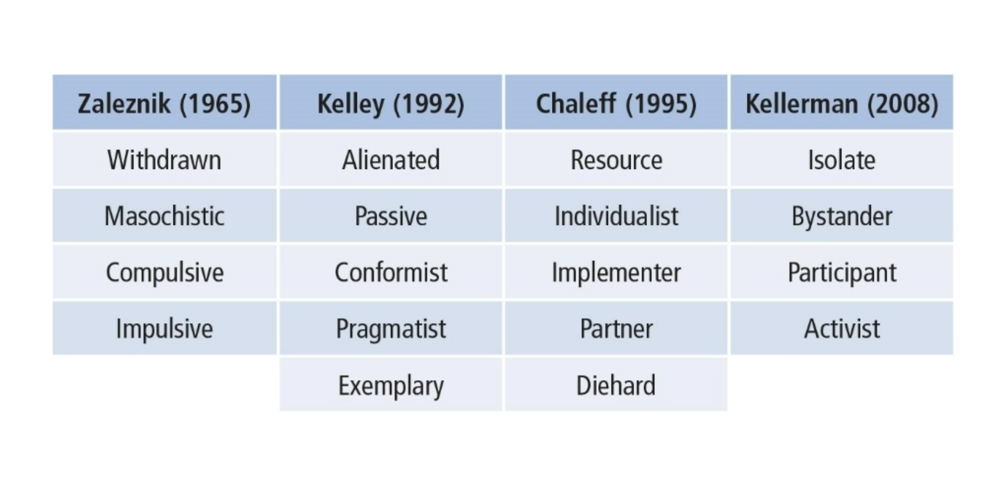
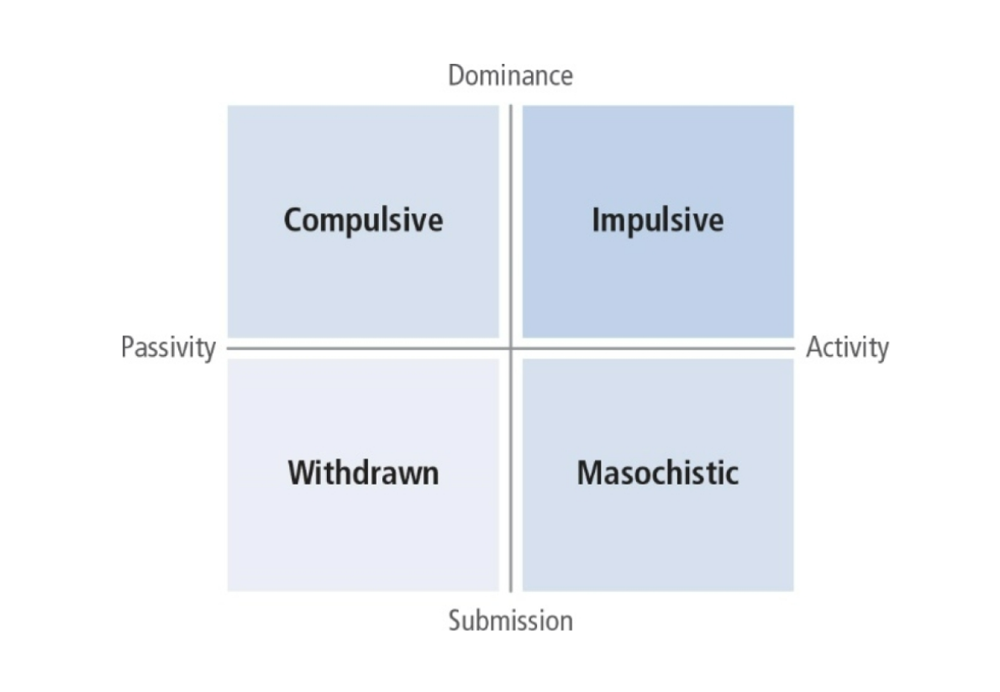
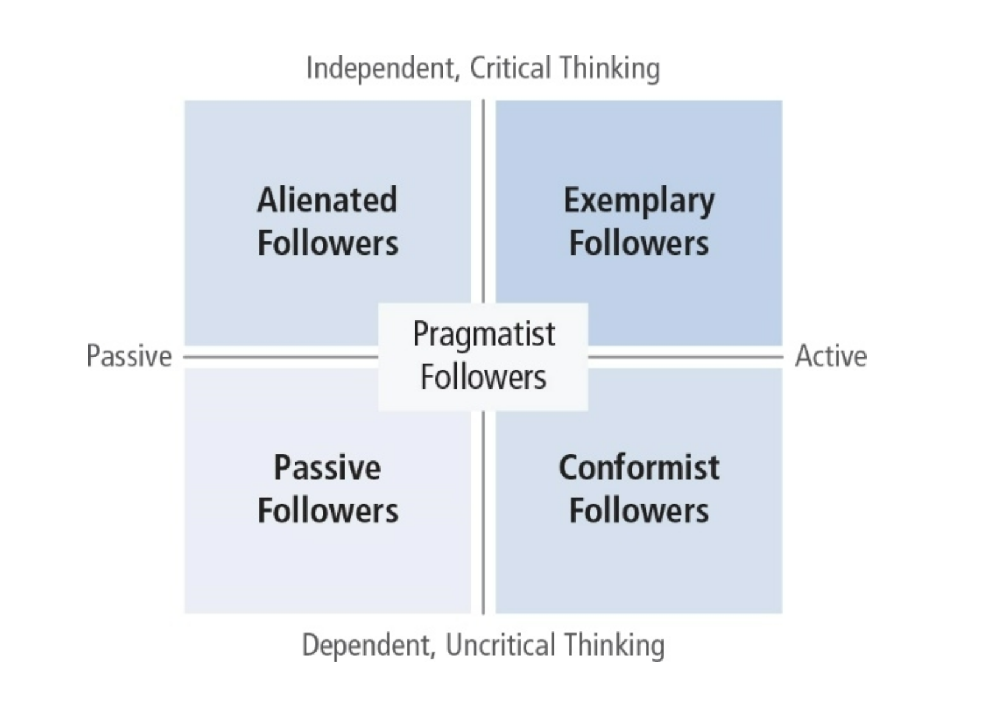
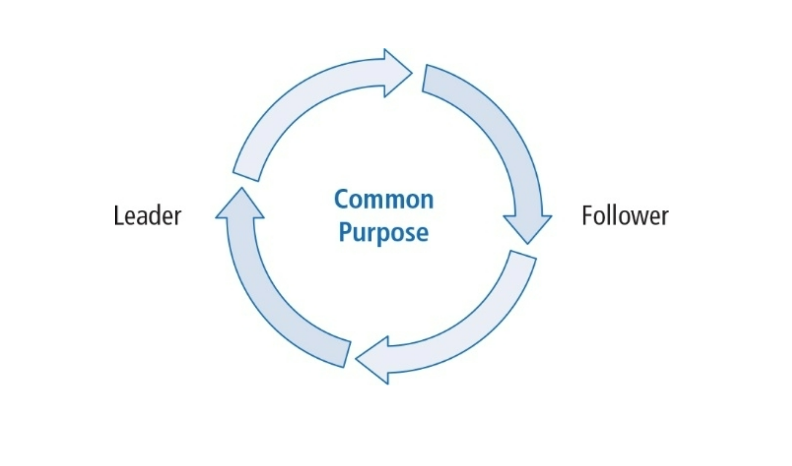
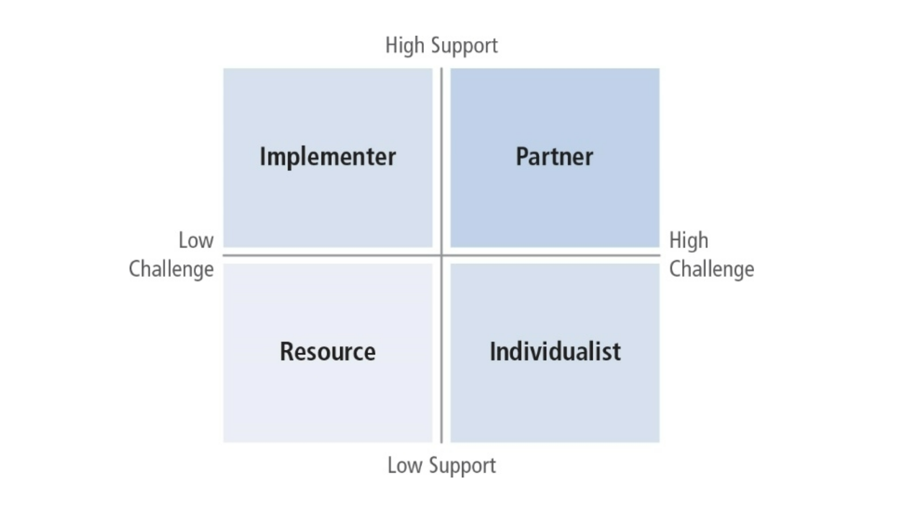
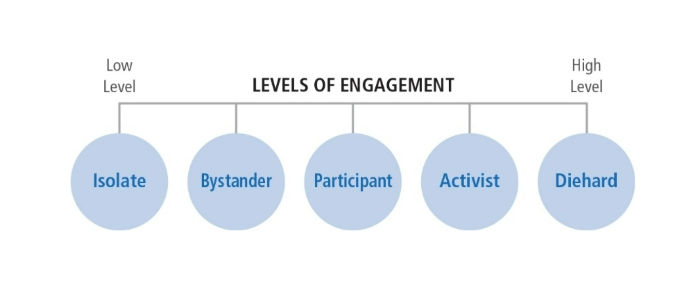
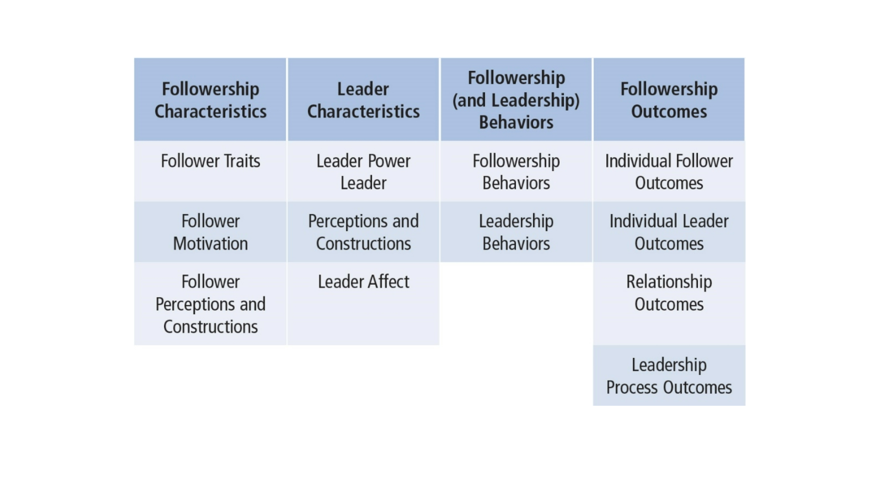
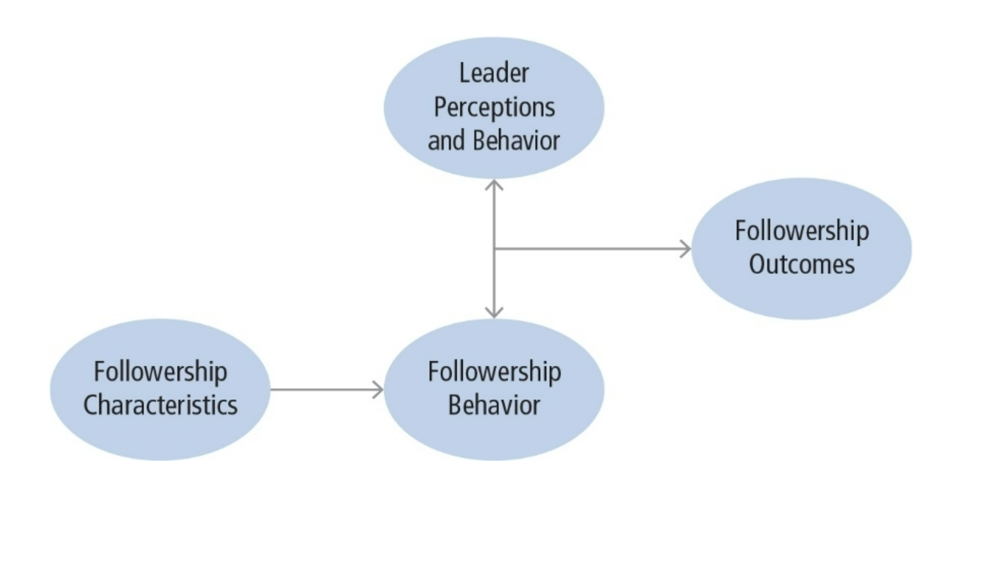
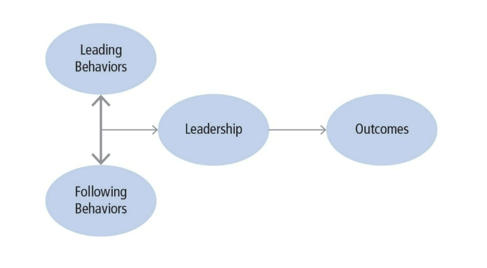
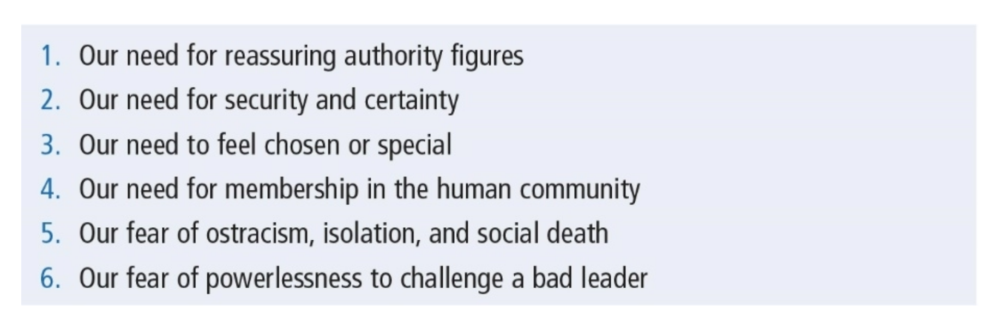

# Chapter 12: Followership

## Table of Contents

- [Description](#Description)
- [Defined](#Defined)
- [Role-Based Perspective](#Role-Based-Perspective)
- [Four Typologies of Followership](#Four-Typologies-of-Followership)
  - [Zaleznik Typology](#Zaleznik-Typology)
  - [Kelly Typology](#Kelly-Typology)
  - [Chaleff Typology](#Chaleff-Typology)
  - [Kellerman Typology](#Kellerman-Typology)
- [The Value of Typologies](#The-Value-of-Typologies)
- [Theoretical Approaches to Followership](#Theoretical-Approaches-to-Followership)
- [Two Theoretical Frameworks](#Two-Theoretical-Frameworks)
  - [Reversing the Lens](#Reversing-the-Lens)
  - [The Leadership Co-Created Process](#The-Leadership-Co-Created-Process)
- [New Perspectives on Followership](#New-Perspectives-on-Followership)
- [Followership and Destructive Leaders](#Followership-and-Destructive-Leaders)
- [How Followership Works](#How-Followership-Works)
- [Strengths](#Strengths)
- [Criticisms](#Criticisms)
- [Application](#Application)

## Description

- Followers play a central role in the leadership process.
- Historically, leaders have captured most of our attention.
- Leaders have been viewed as the causal agents for organizational change.
- Today, researchers view leadership as a shared process. Leaders and followers are interdependent.
- The world needs more followers, and less glorified leaders.

## Defined

- Followership--is a process whereby an individual or individuals accept the influence of others to accomplish a common goal.
- Followership has an ethical dimension; it is not morally neutral.
- There are ethical consequences to followership; the character and behavior of followers have an impact on organizational outcomes.

## Role-Based Perspective

- Focus is on the typical roles followers enact while occupying a formal or informal position within a hierarchical system.
- Followers’ behaviors affect the leader and organizational outcomes.
- Based on social constructivism: People create meaning about their reality as they interact with each other.
- Followership is co-created by the leader and follower in a given situation through communication.
- Leadership occurs as people exert influence on each other and respond to those influence attempts.

## Four Typologies of Followership

### Zaleznik Typology

- Psychological view of follower behaviors
- Two axes of follower behaviors:
  - dominance/submission
  - passivity/activity
- Four types of followers
  - withdrawn (submissive/passive)
  - masochistic (submissive/active)
  - compulsive (dominance/passive)
  - impulsive (dominance/active)

- Types represent followers’ responses to inner tensions regarding authority. Tensions may be unconscious but often come to the surface when interacting with the leader.

### Kelly Typology

- Most recognized followership typology
- Followers are enormously valuable to organizations
- Emphasizes the motivations of followers
- What accounts for exemplary followership?
- Two axes of follower behavior:
  - independent critical thinking/dependent uncritical thinking
  - active/passive

- Passive followers: Look to leader for direction and motivation
- Conformist followers: On the leader’s side but still look for direction and guidance
- Alienated followers: Think for themselves and exhibit negative energy
- Exemplary followers: Active, positive, and offer independent constructive criticism
- Effective followers share same qualities:
  1. They self-manage and think for themselves; exercise control, work without supervision.
  2. They show strong commitment to organizational goals and well as personal goals.
  3. They build their competence and master job skills.
  4. They are credible, ethical, and courageous.

### Chaleff Typology

- Developed from WWI experience. Why do people follow toxic leaders like Hitler? What can be done to prevent this from recurring?
- Followers serve a common purpose along with leaders.
- Followers need to take a more proactive role.
- Followers need to take more responsibility, feel more agency, and confidence in ability to influence others.

- Prescriptive approach to making courageous followers:
  - Assume responsibility for the common purpose
  - Support the leader and organization
  - Constructively challenge the leader if the common purpose or integrity of the group is being threatened
  - Champion the need for change when necessary
  - Take a moral stand that is different from the leader’s to prevent ethical abuses

- Two axes of courageous followership:
  - courage to support (low–high)
  - courage to challenge (low–high)
- Four styles of followership
  - Resource (low support, low challenge)
  - Individualist (low support, high challenge)
  - Implementer (high support, low challenge)
  - Partner (high support, high challenge)

### Kellerman Typology

- Developed from perspective of political science
- Leaders’ importance overestimated because they have more power, authority and influence; importance of followers is underestimated.
- Followers are “unleaders” with less rank and who defer to leaders.

- Followers differentiated on one attribute: Level of engagement (low–high)
- Five levels of followers:
  1. Isolates are completely unengaged.
  2. Bystanders are observers who do not participate.
  3. Participants are partially engaged and willing to take a stand on issues.
  4. Activists feel strongly about the leader and the leader’s policies and act on their own beliefs.
  5. Diehards are totally dedicated to their cause; deeply committed to supporting the leader or opposing the leader.

## The Value of Typologies

- Provide a starting point for research
- Highlight many ways followers have been conceptualized
- Share some commonalities among them
- Provide labels for follower types which can assist leaders in effectively communicating with them

## Theoretical Approaches to Followership

- Uhl-Bien (2014)--Followership is comprised of “characteristics, behaviors and processes of individuals acting in relation to leaders.”
- Followership is a relationally-based process that includes how followers and leaders interact to construct leadership and its outcomes.

- Follower characteristics
  - attributes, traits, motivations, and perceptions
- Leader characteristics
  - attributes, power, perceptions, and affect
- Followership and leadership behaviors
  - Extent to which followers obey, defer to, or resist the leader
  - How leader influences followers to respond
- Followership outcomes
  - Results that influence the follower, leader, their relationship, and the leadership process.

## Two Theoretical Frameworks

### Reversing the Lens

- Focus on how followers affect leaders and organizational outcomes
- Followers can be change agents
  - Impact of follower characteristics onfollowerbehavior
  - Impact of follower behavior on leaderperceptions and behaviors and vice versa
  - Impact of both followers and leaders on followership outcomes

### The Leadership Co-Created Process

- One person’s leadership behaviors interact with another person’s followership behaviors to create leadership and its outcomes.
- Leader behaviors are influence attempts.
- Follower behaviors grant power to another, comply, or challenge.

## New Perspectives on Followership

1. Followers get the job done
2. Followers work in the best interest of the organization’s mission
3. Followers challenge leaders
4. Followers support the leader
5. Followers learn from leaders

## Followership and Destructive Leaders

## How Followership Works

- Discussing followership elevates its importance and the value of followers
- Followership is about how individuals accept influence of others to reach a common goal
- Research helps us understand why harmful leadership occurs and sometimes goes unrestrained

## Strengths

- Recognizes followership as an integral part of the leadership equation
- Forces a whole new way for people to think about leadership, and to focus on followers
- Views leadership as co-constructed
- Provides a set of basic prescriptions for what a follower should or shouldn’t’ do to be effective

## Criticisms

- Little methodical research ahs been done so far
- Current followership literature primarily based on observation and anecdote
- Leader-centric view of leadership may be too ingrained for followership to gain importance

## Application

- Followership is as important as leadership.
- Learning about leadership can be useful for organizational training and development.
- Leaders can learn how to understand followers and how to most effectively work with them.
