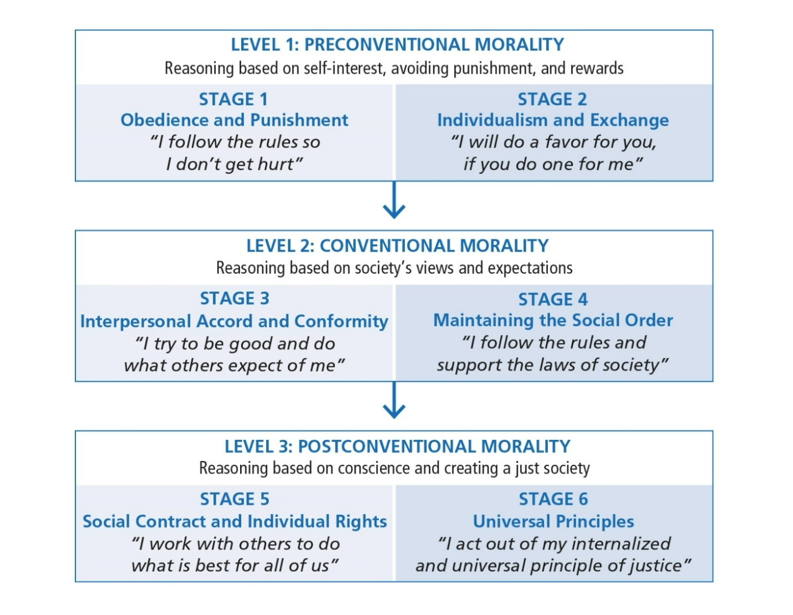
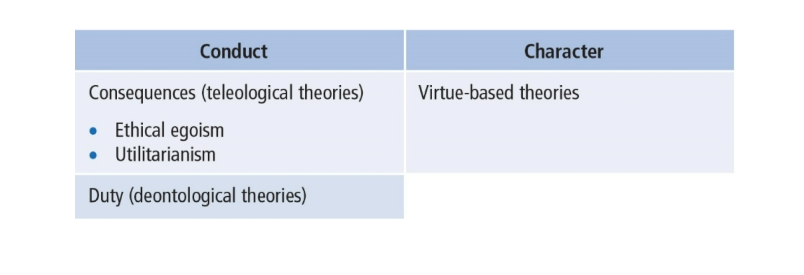
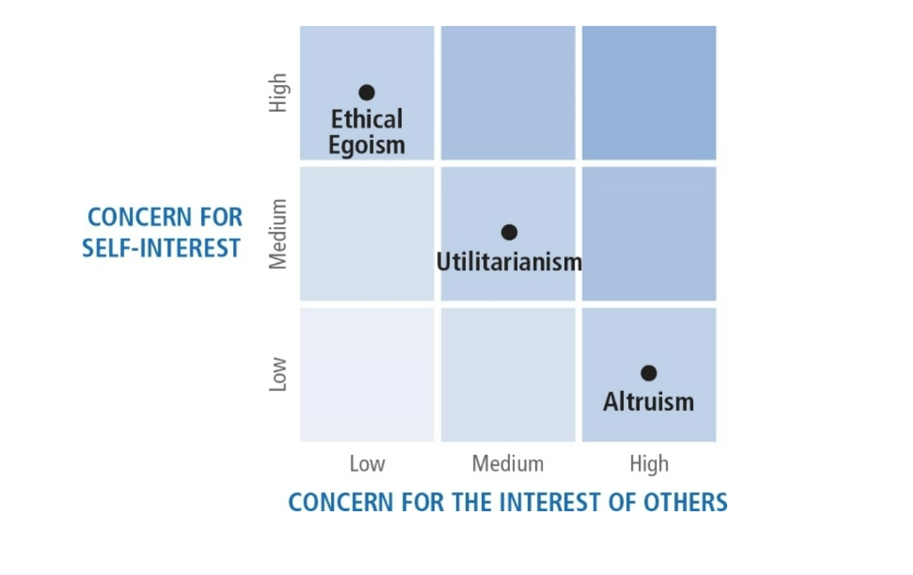
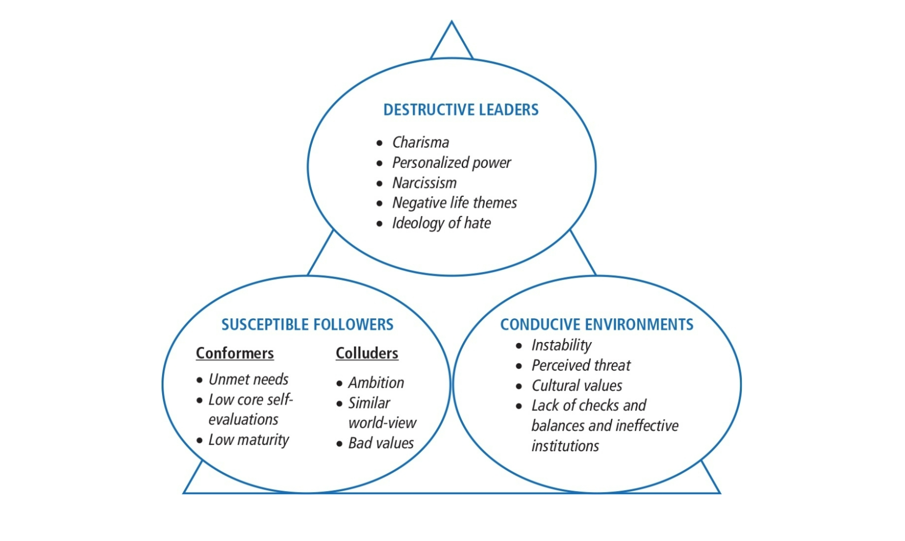
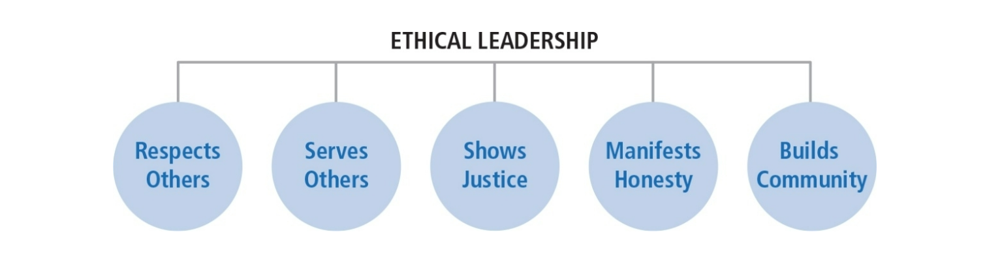
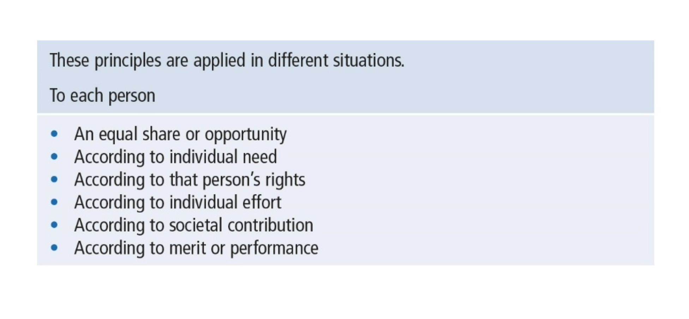

# Chapter 13: Leadership Ethics

## Table of Contents

- [Leadership Ethics Description](#Leadership-Ethics-Description)
- [Practical Ethical Theory](#Practical-Ethical-Theory)
- [Ethical Theories](#Ethical-Theories)
- [Centrality of Ethics to Leadership](#Centrality-of-Ethics-to-Leadership)
- [Diverse Perspectives of Leadership](#Diverse-Perspectives-of-Leadership)
  - [Heifetz’s Perspective](#Heifetz’s-Perspective)
  - [Burns’s Perspective](#Burns’s-Perspective)
- [The Dark Side of Leadership](#The-Dark-Side-of-Leadership)
- [The Toxic Triangle](#The-Toxic-Triangle)
- [Ethical Leaders Respect Others](#Ethical-Leaders-Respect-Others)
- [Principles of Ethical Leadership](#Principles-of-Ethical-Leadership)
- [Strengths](#Strengths)
- [Criticisms](#Criticisms)
- [Application](#Application)

## Leadership Ethics Description

**Ethics**

- Is a derivative of the Greek word ethos, meaning customs, conduct, or character
- Is concerned with the kinds of values and morals an individual or society ascribes as desirable or appropriate
- Focuses on the virtuousness of individuals and their motives
- Example: Journalists’ respect for others, professional duty, concern for harm, proactive social engagement (Plaisance, 2017)

**Ethical Theory**

- Provides a system of rules or principles as a guide in making decisions about what is right/wrong and good/bad in a specific situation
- Provides a basis for understanding what it means to be a morally decent human being

## Practical Ethical Theory

**Kohlberg’s Stages of Moral Development**

1. _Pre-conventional morality_:

   - Stage 1--Obedience and Punishment: Rules are fixed and handed down by authority
   - Stage 2--Individualism and Exchange: An action is right if it serves the individual

2. Conventional morality

   - Stage 3--Interpersonal Accord and Conformity: Conforming to the expectations of others
   - Stage 4--Maintaining the Social Order: Moral decisions show concern for society as a whole

3. Level 3. Post-conventional Morality
   - Stage 5--Social Contract and Individual Rights: Moral decisions based on what a good society should be like
   - Stage 6--Universal Principles: Moral decisions based on internalized universal principles of justice that apply to everyone

## Ethical Theories

- Two Broad Domains: Theories about leaders’ conduct and about leaders’ character

Teleological Theories: focus on consequences of actions and results

**Conduct**

- Ethical egoism (create greatest good for the leader)
  - Closely related to transactional leadership theories
  - Example: leader takes a political stand on an issue for no other reason than to get re-elected
- Utilitarianism (create greatest good for greatest number)
  - Example: Leader distributes scarce resources so as to maximize benefit to everyone, while hurting the fewest; preventive health care vs. catastrophic illnesses
- Altruism (show concern for best interests of others)
  - Authentic transformational leadership is based on altruistic principles
  - Example: The work of Mother Teresa, who gave her entire life to help the poor
- Deontological Theories
  - Duty driven, for example, relates not only to consequences but also to whether action itself is good
  - Focus on the actions of the leader and his/her moral obligation and responsibilities to do the right thing
  - Example: telling the truth, keeping promises, being fair
- Virtue-based Theories: About leader’s character
  - Focus on who people are as people
    - Rather than tell people what to do, tell people what to be
    - Help people become more virtuous through training and development
    - Virtues are present within person’s disposition; practice makes good values habitual
    - Examples: Courage, honesty, fairness, justice, integrity, humility

## Centrality of Ethics to Leadership

- Influence dimension of leadership requires the leader to have an impact on the lives of followers
- Power and control differences create enormous ethical responsibility for leaders
- Respect for persons--sensitive to followers’ own interests and needs
- Leaders help to establish and reinforce organizational values--an ethical climate

## Diverse Perspectives of Leadership

### Heifetz’s Perspective

- Emphasizes how leaders help followers to confront conflicting values and to effect change from conflict

  - Ethical perspective that speaks directly to
    - Values of workers
    - Values of organizations and the communities in which they work

- Leaders use authority to mobilize followers to

  - Get people focused on issues
  - Act as a reality test regarding information
  - Manage and frame issues
  - Orchestrate conflicting perspectives
  - Facilitate the decision-making process
  - Get people focused on issues
  - Act as a reality test regarding information
  - Manage and frame issues
  - Orchestrate conflicting perspectives
  - Facilitate the decision-making process

- Leader provides a holding environment, a supportive context in which there is

  - Trust, nurturance, & empathy

- Leader’s duties
  - Assist the follower in struggling with change and personal growth

### Burns’s Perspective

- Theory of Transformational Leadership
  - Strong emphasis on followers’ needs, values, and morals
  - Leaders help followers in their personal struggles concerning conflicting values
  - Stressing values such as liberty, justice, and equality
  - Connection between leader and follower
    - Raises level of morality of both
- Leader’s Role
  - Assist followers in assessing their values & needs
  - Help followers to rise to a higher level of functioning

## The Dark Side of Leadership

- Pseudotransformational leadership
- Characterized by destructive behaviors, such as violating basic human rights (Lipman-Blumen, 2005)
- Characterized by personal characteristics, such as lack of integrity, insatiable ambition, arrogance (Lipman-Blumen)
- Eight factors of perceived toxicity in leaders: managerial incompetency, dark traits, derisive supervision, impervious despotic leadership, dearth of ethics, erratic behavior, narcissism, and self-promoting (Singh et al., 2017)
- Associated with workplace outcomes such as negative attitudes in followers toward jobs and organization as a whole (Schyns and Schilling, 2013)

## The Toxic Triangle

- Destructive Leaders
  - Charismatic, narcissistic, self-absorbed
- Susceptible Followers
  - Conformers and colluders
- Conducive Environments
  - Unstable environments may grant leader more authority

## Ethical Leaders Respect Others

Ethics--is central to leadership because of

- The process of influence
- The need to engage followers to accomplish mutual goals
- The impact leaders have on establishing the organization’s values

## Principles of Ethical Leadership

### Respects Others

Treating others as ends (their own goals) rather than as means (to leaders’ personal goals)

Leader behaviors:

- Listens closely to subordinates
- Is empathic
- Is tolerant of opposing viewpoints

Leader shall:

- Treat other people’s values and decisions with respect
- Allow others to be themselves with creative wants and desires
- Approach others with a sense of unconditional worth and value individual differences

### Serves Others

Follower centered--Based on the altruistic principle of placing followers foremost in the leader’s plans

Leader behaviors

- Mentoring behaviors
- Empowerment behaviors
- Team-building behaviors
- Citizenship behaviors

Leaders have

- A duty to help others pursue their own legitimate interests and goals
- To be stewards of the organization’s vision; in serving others they: clarify, nurture, and integrate the vision with, not for, organization members
- An ethical responsibility to make decisions that are beneficial to their followers’ welfare

### Shows Justice

Ethical leaders are concerned with issues of fairness and justice; they place issues of fairness at the center of their decision making

Leader behaviors

- All subordinates are treated in an equal manner
- In special treatment/special consideration situations, grounds for differential treatment are clear, reasonable, and based on sound moral values

Leaders shall:

- Adhere to principles of distributive justice

### Manifests Honesty

Honest leaders are authentic but also sensitive to the feelings and attitudes of others

Leader behaviors

- Don’t promise what you can’t deliver
- Don’t suppress obligations
- Don’t evade accountability
- Don’t accept “survival of the fittest” pressures
- Acknowledge and reward honest behavior in the organization

Leaders:

- Are not deceptive
- Tell the truth with a balance of openness and candor while monitoring what is appropriate to disclose in a particular situation

### Builds Community

Concern for common good means leaders cannot impose their will on others; they search for goals that are compatible with everyone.

Leader behaviors

- Takes into account purposes of everyone in the group
- Is attentive to interests of the community and culture
- Does not force others or ignore intentions of others

Ethical leaders & followers

- take into account purposes of everyone in the group, and
- reach out beyond their own mutually defined goals to wider community

## Strengths

- Provides a body of timely research on ethical issues
- Provides direction on how to think about ethical leadership and how to practice it
- Suggests that leadership is not an amoral phenomenon and that ethics should be considered as integral to the broader domain of leadership
- Highlights principles and virtues that are important in ethical leadership development

## Criticisms

- Lacks a strong body of traditional research findings to substantiate the theoretical foundations. Conceptual confusion regarding the concept; hard to measure (Exception is Yukl et al., 2013)
- Relies heavily on writings of just a few individuals that are primarily descriptive and anecdotal in nature and are strongly influenced by personal opinion and a particular worldview.
- Most research based on Western world and Anglo-American countries
- Generational differences in ethical perspectives

## Application

- Can be applied to individuals at all levels of organization and in all walks of life.
- Because leadership has a moral dimension, being a leader demands awareness on our part of the way our ethics define our leadership.
- Managers and leaders can use information on ethics to understand themselves and strengthen their own leadership.- Leaders can use ethical principles as benchmarks for their own behavior.
- Leaders can learn that leader-follower relationship is central to ethical leadership.
