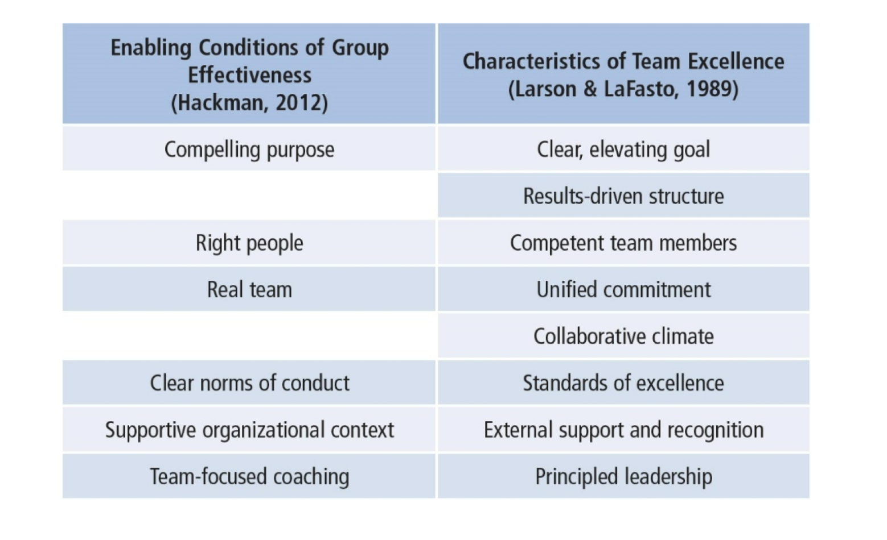
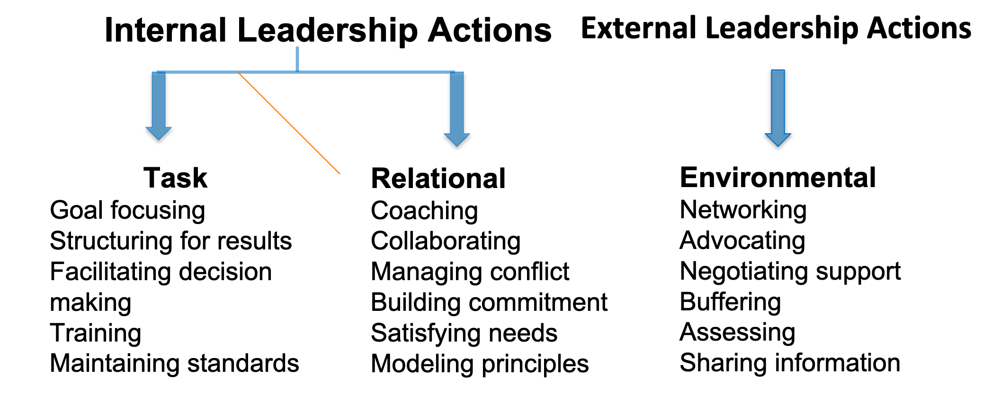

# Chapter 14: Team Leadership

## Table of Contents

- [Descriptions and Perspectives](#Descriptions-and-Perspectives)
- [Outcomes of Effective Teams](#Outcomes-of-Effective-Teams)
- [Team Leadership Model](#Team-Leadership-Model)
- [Team Effectiveness](#Team-Effectiveness)
  - [Standards of Excellence](#Standards-of-Excellence)
  - [External Support and Recognition](#External-Support-and-Recognition)
- [Leadership Decision 1](#Leadership-Decision-1)
- [Leadership Decision 2](#Leadership-Decision-2)
- [Leadership Decision 3](#Leadership-Decision-3)
- [Leadership Actions](#Leadership-Actions)
- [Internal Task Leadership Actions](#Internal-Task-Leadership-Actions)
- [External Environmental Leadership Actions](#External-Environmental-Leadership-Actions)
- [Strengths](#Strengths)
- [Criticisms](#Criticisms)
- [Application](#Application)

## Descriptions and Perspectives

Team = Group of organizational members who are interdependent, share common goals, and coordinate activities to accomplish those goals

- Can meet face-to-face or be virtual
- Team-based and technology-enabled can use best talent, facilitate collaboration, and reduce travel costs
- But virtual teams are also challenged by separations of time, distance, and culture
- Decisions and scheduling may take more time

Organizational culture needs to support employee involvement

- Heterarchy: fluid power shifting in teams

Team leadership is process oriented

- How do teams develop critical capabilities?
- How do team leaders adjust to contingencies as they arise?
- How do leader actions promote task and interpersonal development?

Shared or Distributed Leadership

- When members of the team take on leadership behaviors to influence the team and maximize team effectiveness
- Shared team leadership improves effectiveness of virtual teams

## Outcomes of Effective Teams

- Greater productivity
- More effective use of resources
- Better decisions and problem-solving
- Better-quality products and services
- Greater innovation and creativity (Parker, 1990)

## Team Leadership Model

Model provides leader or designated team member with a mental model to help

- Diagnose team problems, and
- Take appropriate action to correct team problems

Effective team performance begins with leader’s mental model of the situation

Mental model reflects

- Components of the problem
- Environmental and organizational contingencies

## Team Effectiveness

- Clear, Elevating Goal
  - Clear so that one can tell whether performance objective has been met
  - Motivating or involving so that members believe it is worthwhile and important
- Results-Driven Structure
  - Need to find the best structure to achieve goals
  - Clear team member roles
  - Good communication system
  - Methods to assess individual performance
  - An emphasis on fact-based judgments
- Core Competencies
  - Ability to do the job well
  - Problem-solving ability
- Competent Team Members

  - Components
    - Right number and mix of members
    - Members must be provided
      - Sufficient information
      - Education and training
    - Requisite technical skills
    - Interpersonal and teamwork skills
  - Team Factors
    - Openness
    - Supportiveness
    - Action orientation
    - Positive personal style

- Unified Commitment
- Teams need a carefully designed and developed sense of unity or identification (team spirit)
- Collaborative Climate
- Trust based on openness, honesty, consistency, and respect
- Integration of individual actions
- Teams contribute to collective success by
  - Coordinating individual contributions
  - Team leaders making communication safe
  - Team leaders demanding and rewarding collaborative behavior
  - Team leaders guiding the team’s problem-solving efforts
  - Team leaders managing their own control needs

### Standards of Excellence

Regulated Performance

- Facilitates task completion and coordinated action
- Stimulates a positive pressure for members to perform at highest levels

How Accomplished

- Requiring results (clear expectations)
- Reviewing results (feedback/resolve issues)
- Rewarding results (acknowledge superior performance)

### External Support and Recognition

- Regulated Performance
- Teams supported by external resources are
  - Given the material resources needed to do their jobs
  - Recognized for team accomplishments
  - Rewarded by tying those rewards to team members’ performance, not individual achievement

Principled Leadership influences team effectiveness through four sets of processes (Zaccaro et al., 2001)

1. **Cognitive**--Facilitates team’s understanding of problems confronting them
2. **Motivational**--Helps team become cohesive and capable by setting high performance standards and helping team to achieve them
3. **Affective**--Assists team in handling stressful circumstances by providing clear goals, assignments, and strategies
4. **Integrative**--Helps coordinate team’s activities through matching member roles, clear performance strategies, feedback, and adapting to environmental changes

## Leadership Decision 1

**Should I Monitor the Team or Take Action?**

- Leaders can
  - Diagnose, analyze, or forecast problems (monitoring) or take immediate action to solve a problem
  - Focus on problems within the group (internal) or which problems need intervention
  - Make choices about which solutions are the most appropriate
- Effective leaders have the ability to determine what interventions are needed, if any, to solve team problems
- All members of the team can engage in monitoring
- Leaders differ in timing of taking action

## Leadership Decision 2

**Should I Intervene to Meet Task or Relational Needs?**

Task

- Getting job done
- Making decisions
- Solving problems
- Adapting to change
- Making plans
- Achieving goals

Maintenance Functions

- Developing positive climate
- Solving interpersonal problems
- Satisfying members’ needs
- Developing cohesion

Special challenges of virtual teams

- Leaders should begin with face-to-face meetings to facilitate trust
- Hold regular, organized team meetings
- Not be too task focused
- Work to develop relationships among team members
- Know which technologies are best suited for which task

## Leadership Decision 3

**Should I Intervene Internally or Externally?**

Leader must

- Determine what level of team process needs leadership attention:
- Use internal task or relational team dynamics, if
  - Conflict between group members
  - Team goals unclear
- Use external environmental dynamics, if
  - Organization not providing proper support to team

## Leadership Actions

Leadership Functions--performed internally or externally

## Internal Task Leadership Actions

Set of skills or actions leader might perform to improve task performance:

- Goal focusing (clarifying, gaining agreement)
- Structuring for results (planning, visioning, organizing, clarifying roles, delegating)
- Facilitating decision making (informing, controlling, coordinating, mediating, synthesizing, issue focusing)
- Training team members in task skills (educating, developing)
- Maintaining standards of excellence (assessing team and individual performance, confronting inadequate performance)

Set of actions leader needs to implement to improve team relationships:

- Coaching team members in interpersonal skills
- Collaborating (including, involving)
- Managing conflict and power issues (avoiding confrontation, questioning ideas)
- Building commitment and esprit de corps (being optimistic, innovating, envisioning, socializing, rewarding, recognizing)
- Satisfying individual member needs (trusting, supporting, advocating)
- Modeling ethical and principled practices (fair, consistent, normative)

## External Environmental Leadership Actions

Set of skills or behaviors leader needs to implement to improve environmental interface with team:

- Networking and forming alliances in environment (gather information, increase influence)
- Advocating and representing team to environment
- Negotiating upward to secure necessary resources, support, and recognition for team
- Buffering team members from environmental distractions
- Assessing environmental indicators of team’s effectiveness (surveys, evaluations, performance indicators)
- Sharing relevant environmental information with team

## Strengths

- Focus on real-life organizational group work; model is useful for teaching
- Provides a cognitive guide that assists leaders in designing and maintaining effective teams
- Recognizes the changing role of leaders and followers in organizations
- Can be used as a tool in group leader selection

## Criticisms

- Model is incomplete. Additional skills might be needed
- May not be practical as the model is complex and doesn’t provide easy answers for difficult leader decisions
- Fails to consider teams that have distributed leadership, where team members have a range of skills, and where roles may change
- More focus required on how to teach and provide skill development in areas of diagnosis and action taking

## Application

- Useful in leader decision-making
- Can be used as a team diagnostic tool
