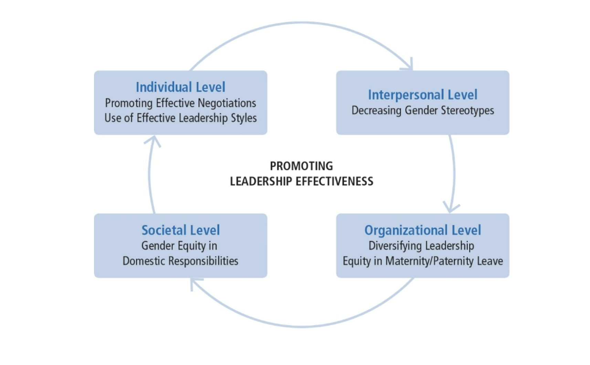

# Chapter 15: Gender and Leadership

## Table of Contents

- [Gender and Leadership Approach Description](#Gender-and-Leadership-Approach-Description)
- [The Glass Ceiling Turned Labyrinth](#The-Glass-Ceiling-Turned-Labyrinth)
- [The Gender Gap in Leadership](#The-Gender-Gap-in-Leadership)
- [Understanding the Labyrinth](#Understanding-the-Labyrinth)
  - [Human Capital Differences](#Human-Capital-Differences)
  - [Prejudice](#Prejudice)
  - [Gender Stereotypes](#Gender-Stereotypes)
  - [How Stereotypes Affect Women Themselves](#How-Stereotypes-Affect-Women-Themselves)
- [Effectiveness of Male and Female Leaders](#Effectiveness-of-Male-and-Female-Leaders)
- [Commitment to Employment and Motivation to Lead](#Commitment-to-Employment-and-Motivation-to-Lead)
- [Navigating the Labyrinth](#Navigating-the-Labyrinth)
- [Strengths](#Strengths)
- [Criticisms](#Criticisms)
- [Application](#Application)

## Gender and Leadership Approach Description

- Historical context

  - Researchers ignored issues related to gender and leadership until the 1970s
  - Scholars started by asking “Can women lead?”
  - Changed by women in leadership •Presence of women in corporate and political leadership•Highly effective female leaders--PepsiCo’s CEO, GM’s CEO, General Ann Dunwoody, and so on.

- Current research primary questions
  - Do men and women lead differently?
  - Are men more effective leaders than women?
  - Why are women underrepresented in elite leadership roles?

## The Glass Ceiling Turned Labyrinth

In General

- Currently outnumber men in higher education--57% of bachelor’s degrees, 60% of master’s degrees, more than 50% of doctorates, nearly half of professional degrees (Catalyst, 2017).
- Make up nearly half of the U.S. labor force--47%
- Still are underrepresented in upper echelons of America’s corporations and political system
- Represent only 5.4% of Fortune 500 CEOs (Brown, 2017)
- Hold only 20.2% of Fortune 500 board seats (Catalyst, 2017)

In Politics

- 105 of the 535 seats in the U.S. Congress = 19.6%
- 21%: Senate; 19.3%: House of Representatives
- Women of color occupy just 38 seats (Center for Women and Politics, 2017a,b)
- World average of women’s representation in national legislatures or parliaments is 23.3%. The United States is ranked 101st out of 193 countries (Inter-Parliamentary Union, 2017).
- High-ranking U.S. women military officers = 6.9% (U.S. Dept. of Defense, 2014)

## The Gender Gap in Leadership

- Global phenomenon whereby women are disproportionately concentrated in lower level and lower authority leadership positions than men. (Powell & Graves, 2003)
- Three types of explanations

## Understanding the Labyrinth

### Human Capital Differences

- Pipeline Problem--Women have less education, training, and work experience than men resulting in a dearth of qualified women.
- Pipeline is not empty but leaking--Explanation that women haven’t been in managerial positions long enough for natural career progression to occur (Heilman, 1997); not supported by research.
- Domestic division of labor--Explanation that women self-select out of leadership tracks by choosing “mommy track” positions that do not funnel into leadership positions (Belkin, 2003; Ehrlich, 1989; Wadman, 1992); not supported by research (Eagly & Carli, 2004).

**Women**:

- do have somewhat less work experience and continuity than men, largely due to disproportionate responsibility women assume for child rearing and domestic duties
- respond to work-home conflicts by not marrying, not having children, becoming “superwomen,” taking leaves of absence or working part time
- who use flextime and workplace leave are often marginalized; taking time off from a career makes reentry difficult (Williams, 2010)
- occupy more than half of all management and professional positions (Catalyst, 2017) but have fewer developmental opportunities
- Have fewer responsibilities in the same jobs as men
- are less likely to receive encouragement, be included in key networks, and receive formal job training than their male counterparts
- confront greater barriers to establishing informal mentor relationships
- are more likely to be put in precarious leadership situations associated with greater risk and criticism

**Gender Differences in Leadership Styles and Effectiveness**

Gender = social meaning ascribed to biological sex categories Differences between men and women often assumed to be natural consequence of innate differences.

- Contrary to stereotypical expectations, women leaders aren’t less task oriented or more interpersonal than men leaders.
- Women do lead in a more participative manner than men.
- Adaptive style because women are devalued when they lead in a masculine manner, occupy a typically masculine role, or when evaluators are male.

**Transformational leadership**

- Women’s styles tend to be more transformational than men’s.
- Even as transformational leaders, they are valued less than men.
- Women engage in more contingent behavior than men.
- Women tend to emphasize social values that promote others’ welfare to a greater extent than men.

### Prejudice

- gender bias stemming from stereotyped expectations--“women take care and men take charge”
- Stereotypes = cognitive shortcuts that influence the way people process information regarding groups and group members.
- Gender stereotypes include beliefs about the attributes of men and women and prescribe how men and women ought to be.

### Gender Stereotypes

- Pervasive, well documented, and highly resistant to change (Dodge, Gilroy, & Fenzel, 1995; Heilman, 2001)
- Men are stereotyped with agentic characteristics
  - confidence, assertiveness, independence, rationality, and decisiveness
- Women are stereotyped with communal characteristics
  - concern for others, sensitivity, warmth, helpfulness, and nurturance (Deaux & Kite, 1993; Heilman, 2001)

Gender stereotypes explain numerous findings:

- Women facing cross-pressures to be tough but not too “manly”
- Greater difficulty for women to be viewed as effective in top leadership roles (Eagly & Karau, 2002)
- Penalties for women who violate gender stereotypes (for example, Price Waterhouse vs. Ann Hopkins; media coverage of 2008 Hillary Clinton presidential run)
- Decision-makers influenced by homosocial reproduction, a tendency for a group to reproduce itself in its own image (for example, Male leaders choosing male successors)
- People high in social dominance orientation show stronger preference for leaders who are White and male (Hoyt & Simon, 2016)

### How Stereotypes Affect Women Themselves

- Pressure of tokenism (Kanter, 1977) and being scrutinized.
- Women may assimilate to stereotype OR may counter the stereotype. Depends on
  - leader’s self-efficacy
  - explicitness of the stereotype
  - type of task
  - gender composition of the group
  - power of the leader
  - whether stereotype threats are combined

Intersectionality = People who have multiple identities (gender, ethnicity, sexual orientation, etc.)

- Have different leadership experiences
- Black women may experience bias in leadership positions differently than White women or Black men; sometimes advantaged; sometimes disadvantaged

## Effectiveness of Male and Female Leaders

- Men and women equally effective overall
- Men and women more effective in roles congruent with their gender
- Women less effective than men when role is masculinized (military), when supervising large numbers of men, or when rated by men
- Somewhat more effective in education, government, social service; substantially more effective in middle management

## Commitment to Employment and Motivation to Lead

- Men and women show same level of identification and commitment to paid employment roles.
- Men and women both view roles as workers as secondary to partner and parent roles.
- Women less likely to promote themselves for leadership positions.
- Women less likely to emerge as group leaders; more likely to serve as social facilitators.
- Men place more importance on power-related goals, associate power with less negative outcomes, and are more likely to take advantage of opportunities for professional advancement.
- Men more likely to ask for what they want; women less likely to negotiate or self-promote and receive more backlash when they do.

## Navigating the Labyrinth

Factors contributing to leadership effectiveness and rise of female leaders

- Culture of many organizations is changing
- Gendered work assumptions are being challenged
- Organizations valuing flexible workers and diversity of top managers and leaders
- Developing effective and supportive mentoring relationships
- Increasing parity in domestic responsibilities
- Negotiating for valued positions and resources

Factors contributing to leadership effectiveness and rise of female leaders

- Women’s foray into entrepreneurship (women-owned businesses = 31% of privately owned firms)
- Improving perceptions of women’s leadership by combining communal and agentic qualities
- Adopting transformational leadership style
- Becoming more assertive without losing their femininity

## Strengths

- Understanding the research in gender and leadership can help promote more women into upper echelons of leadership
- Developing a more androgynous style of democratic leadership
- Research on gender and leadership is productive in both dispelling myths about the gender gap and shining a light on aspects of the gender barrier that are difficult to see and therefore are overlooked
- Understanding many components of the labyrinth will give us the tools necessary to combat this inequality from many perspectives
- Research addresses larger, more significant considerations about gender and social systems

## Criticisms

- Leadership researchers should put a greater emphasis on understanding the role of gender, ethnicity, and sexual orientation in leadership processes.
- Researchers should examine the differences in the impact of gender, ethnicity, and sexual orientation on leadership.
- Research in gender issues and leadership is predominantly in Western contexts and should be expanded into other global regions.
- Research on gender and leadership should be expanded to include closing the gender gap at home.

## Application

- Make it easier for women to reach top positions by
  - Understanding obstacles that make up the labyrinth
  - Initiating tactics to eradicate inequality
- Prejudice still a factor and needs to be addressed with awareness
- Women can manage biased perceptions of their leadership by enacting individualized consideration and inspirational motivation
- Using effective negotiation techniques can enhance leadership advancement
- Changes in organizational culture, women’s career development, mentoring opportunities, and increased numbers of women in strategic positions will increase presence of women in prominent leadership roles.
