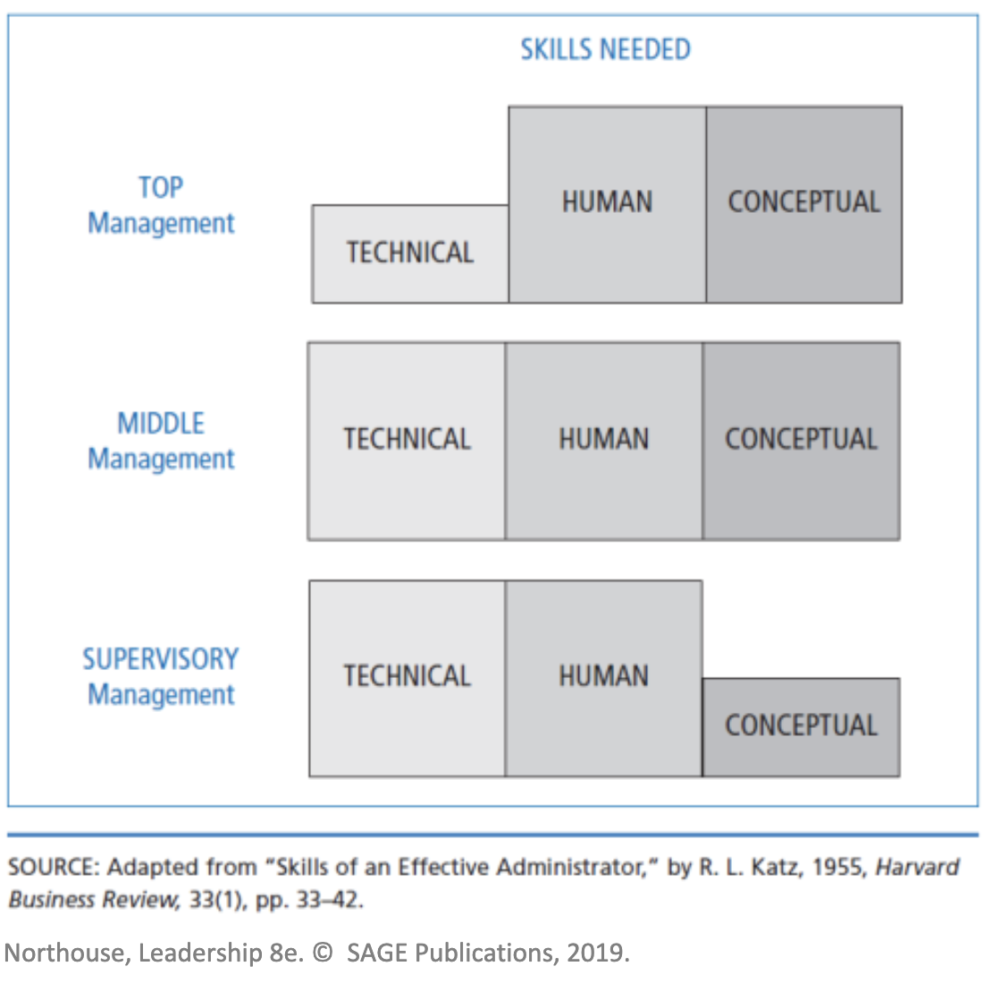
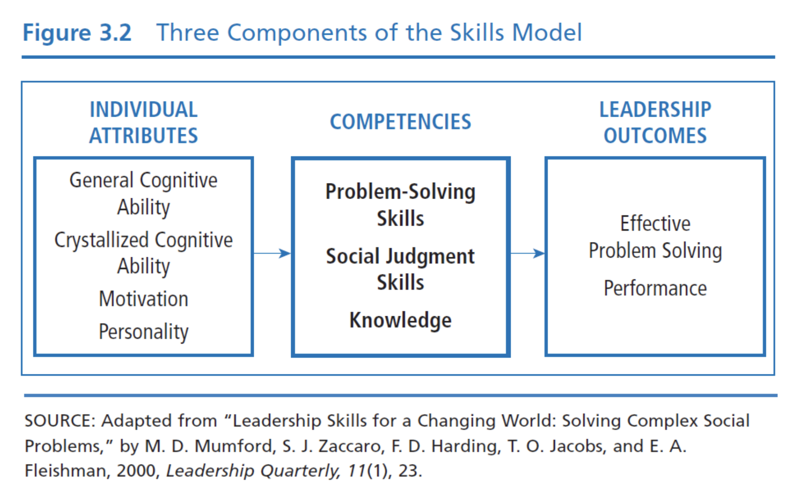

# Chapter 3: Skills approach

This chapter is dedicated to the skills approach to leadership. It focuses on the leader and what skills they have/need and how those can be developed.

Skills are defined as the ability to use one's knowledge and competencies to accomplish a set of goals.

## Table of Contents

- [Three Skills Approach](#three-skills-approach)
  - [Technical Skill](#technical-skill)
  - [Human Skill](#Human-skill)
  - [Conceptual Skill](#Conceptual-skill)
- [Skills-Based Model](#Skills-Based-Model)
  - [Competencies Skills](#Competencies-Skills)
    - [Nine Key Problem Solving Skills](#Nine-Key-Problem-Solving-Skills)
  - [Individual Attributes](#Individual-Attributes)
  - [Leadership Outcomes](#Leadership-Outcomes)
  - [Environmental Influences](#Environmental-Influences)
- [Focus of the Skills Approach](#focus-of-the-skills-approach)
- [Strengths](#Strengths)
- [Criticisms](#Criticisms)
- [Applications](#Applications)

## Three Skill Approach

Katz (1955) described three skills that every leader needs to have.

1. Technical skill
2. Human skill
3. Conceptual skill

Katz determined that through the life of a leader, the skills they would need would vary based on their level of leadership. See the following illustration for a breakdown.

As can be seen, leaders require all three skills but their relative importance changes based on the level of management.

### Technical Skill

Technical skill is having knowledge about and being proficient in a specific type of work or activity. These include: specialize competencies, analytic competencies, the use of appropriate skills and techniques.

They revolve around **hands-on** ability and process. This is most important for lower level management.

### Human Skill

Human Skill is having knowledge about and the ability to relate to people. It involves being aware of one's and others' perspectives, assisting groups to work towards a common goal, fostering an environment of trust and collaboration. It is important at all levels of management.

### Conceptual Skill

Conceptual Skill is the ability to do the mental work of shaping meaning of organizational policy or issues (_what company stands for and where it’s going_). Someone high in conceptual skills will work easily in abstraction and hypothetical notions. This skill is central to creating and articulating a vision and strategic plan for an organization. It is most important in upper level management.

## Skills-Based Model

The Skills-Based Model revolves around several central concepts. They are:

- Individual Attributes
- Leadership Outcomes
- Career Experiences
- Environmental Influences

When being researched, this model was based on what a leader had the capability to do, not what they actually do. It suggests that many people have the potential for leadership.

### Competencies Skills

- Problem Solving: Creative ability to solve new/unusual, ill-defined organizational problems
- Social Judgment: Capacity to understand people and social systems
- Knowledge: The accumulation of information and the mental structures to organize the information

#### Nine Key Problem Solving Skills

1. Problem definition
2. Cause/goal analysis
3. Constraint analysis
4. Planning
5. Forecasting
6. Creative thinking
7. Idea evaluation
8. Wisdom
9. Sense making/visioning

### Individual Attributes

- General Cognitive Ability: innate intelligence (born with this capacity)
- Crystallized Cognitive Ability: Intellectual ability learned or acquired over time
- Motivation: willingness, dominance, social good
- Personality: Any characteristic that helps people cope with complex organizational situations is probably related to leader performance

### Leadership Outcomes

- Problem Solving
- Performance: Degree to which a leader has successfully performed his/her assigned duties

### Career Experiences

- Challenging Assignments
- Mentoring
- Appropriate Training
- Hands-on Experience with Novelty

Experience gained during career influences leader’s knowledge and skills to solve complex problems. Leaders learn and develop higher levels of conceptual capacity if they progressively confront more complex and long-term problems as they ascend the organizational hierarchy.

### Environmental Influences

Factors in a leader’s situation that lie outside of his or her competencies, characteristics, and experiences. These can be internal or external.

Internal: Outdated technology, skill level of employees

External: Economic, political, or social issues; natural disasters

## Focus of the Skills Approach

The skills approach is mostly descriptive. It describes the skills a leader needs to have but it does not tell how to get them. It helps to provide a structure for understanding the nature of effective leadership.

## Strengths

This was the first approach to conceptualize and create a structure around the process of leadership and the skills involved. By describing leadership in a set of terms, it makes it available to everyone that is willing to learn. It provides an expansive view of leadership that incorporates a wide variety of components. It provides a structure consistent with leadership education programs.

## Criticisms

Because the approach is so expansive it extends beyond what is leadership. It does not provide how these skills will produce better leaders so it is weak in predicting outcomes. These skills are also very trait like.

## Applications

This approach delineates the skills of the leader. It can be applied to leaders at all levels of an organization. The skills inventory can provide insights into the individual’s leadership competencies. Test scores allow leaders to learn about areas in which they may wish to seek further training.
