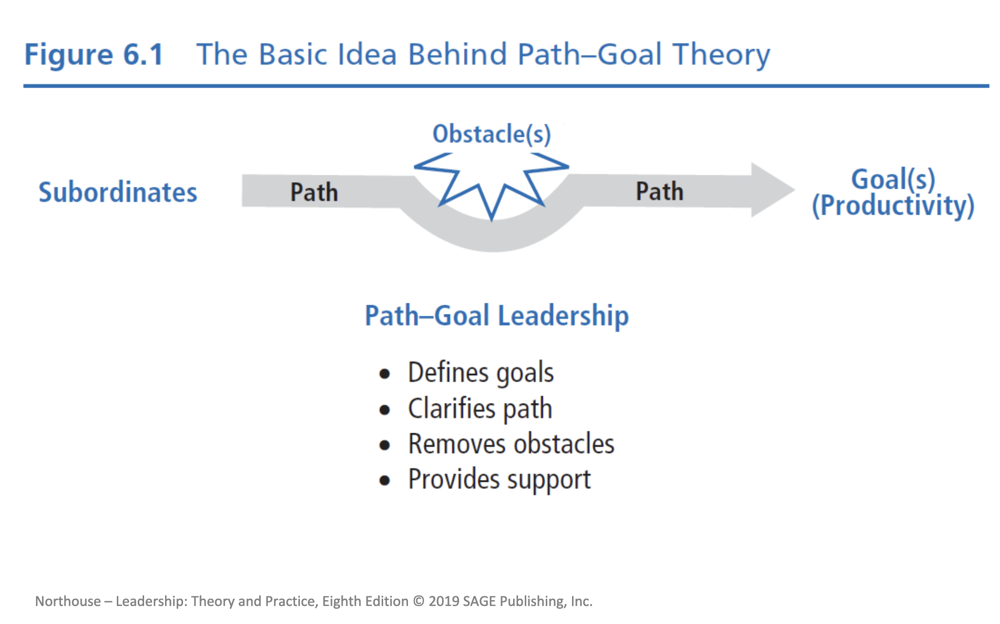
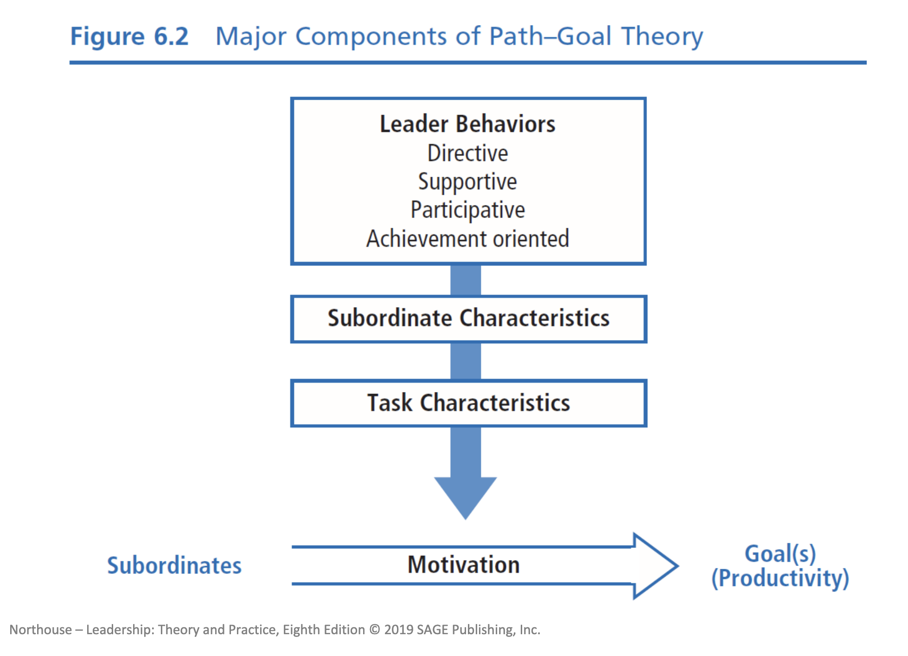
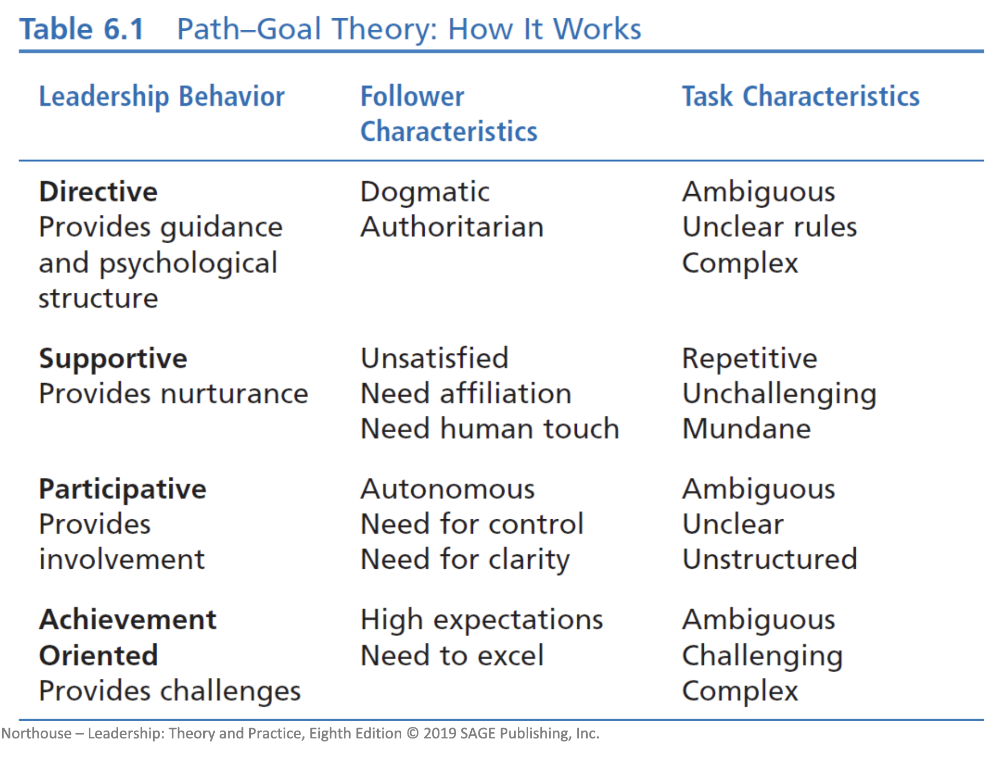

# Path-Goal Theory

Path-Goal Theory focuses on how leaders motivate their followers to accomplish designated goals.
It emphasizes a relationship between the leader's style, the characteristics of the followers, and the work setting.

Their goal is to enhance employee performance and satisfaction by focusing on employee motivation.

Motivation is the key part of this theory.

Followers will be motivated if they believe:

- They are capable of performing the work
- Their efforts will result in a certain outcome
- The payoffs will be worth their while

The leader’s job is to help followers reach their goals by directing, guiding, and coaching them along the way. Leaders must evaluate task and follower characteristics and adapt leadership style to these. The theory suggests which style is most appropriate for specific characteristics.

## Table of Contents

- [Challenge to the Leader](#Challenge-to-the-Leader)
- [Conditions of Leadership Motivation](#Conditions-of-Leadership-Motivation)
- [The Basic Idea behind Path-Goal Theory](#The-Basic-Idea-behind-Path-Goal-Theory)
- [Major Components to Path-Goal Theory](#Major-Components-to-Path-Goal-Theory)
- [Leader Behaviors](#Leader-Behaviors)
  - [Directive Leadership](#Directive-Leadership)
  - [Supportive Leadership](#Supportive-Leadership)
  - [Participative Leadership](#Participative-Leadership)
  - [Achievement-Oriented Leadership](#Achievement-Oriented-Leadership)
- [Follower Characteristics](#Follower-Characteristics)
- [Task Characteristics](#Task-Characteristics)
- [Path–Goal Theory Approach](#Path–Goal-Theory-Approach)
- [Strengths](#Strengths)
- [Criticisms](#Criticisms)
- [Application](#Application)

## Challenge to the Leader

They must find the leadership style that best suites their followers' motivational needs. They will need to find behaviors that complement or supplement what is missing in the work setting. By providing information or rewards, the leader will enhance goal attainment. The leader must also be able to provide the followers with the elements they need to achieve their goals.

## Conditions of Leadership Motivation

Leadership generations motivation when it increases the number and kinds of payoffs followers receive from their work. When the path to the goal is made clear and is made easy to attain through coaching and direction. They must also remove obstacles from attaining the goal. Motivation also increases when the work is more personally satisfying.

## The Basic Idea behind Path-Goal Theory

## Major Components to Path-Goal Theory

## Leader Behaviors

There are four different types of leader behaviors.

### Directive Leadership

There leaders tend to give followers direct orders and task instruction including:

- What is expected of them
- How the task is to be done
- Timeline for task completion
- Clear standards for performance
- Clear rules and regulations

### Supportive Leadership

These leaders tend to be approachable and friendly. Some of their behaviors include:

- Attending to the well-being and human needs of the followers
- Using supportive behavior to make the work environment pleasant
- Treating followers as equals and giving them respect for their status

### Participative Leadership

This leader will invite followers to share in the decision making. Behaviors including:

- Consulting with followers
- Seeking out followers' opinions and ideas
- Integrating their input into organizational decisions

### Achievement-Oriented Leadership

The leader challenges the followers to perform at the highest level possible. They will:

- Establish a high standard of excellence
- Seek continuous improvement
- Demonstrate a high degree of confidence in followers' ability to establish and achieve challenging goals

## Follower Characteristics

Depending on what the follower is like or needs, the leader will need to use one of the above styles.

If the follower has a strong need for affiliation, they will likely respond better to a supportive leadership style. If the follower is looking for psychological structure, they will want an authoritarian directive style. For followers that have a strong internal locus of control and feel like they can make change on their own, the leader should try to use participative leadership. On the other hand, if the follower often feels that everything is out of their control and they have an external locus of control, the leader will need to use directive leadership.

The follower's perception of their own ability for a given task will have a huge affect on the leadership behavior that will be used. As the follower's perception of their own ability and competence goes up, the need for highly directive leadership will go down. In these cases, the need for directive leadership will become redundant and likely come across as controlling.

## Task Characteristics

Different task situations will require a different style of leadership. If the task is unclear and ambiguous, the leader will need to provide structure. With tasks that are highly repetitive, the leader needs to provide support to maintain follower motivation. In a situation of weak formal authority, the leader needs to assist followers by making rules and work requirements clear. Finally, in situations when their is weak group norms, the leader will provide the cohesion and role responsibility necessary.

Obstacles are of prime concern to leaders in this theory. Anything that gets in the way of the followers is an obstacle. The leader's responsibility is to help followers by removing these obstacles and helping followers around them. As obstacles are removed, followers will feel more likely to complete their task and their job satisfaction will increase.

## Path–Goal Theory Approach

The path-goal theory is complex but also very pragmatic. Leaders should choose a leadership style that best fits the needs of their followers and their work. The theory provides a set of assumptions about how different leadership styles will interact with follower characteristics and the work situation to affect employee motivation.

## Strengths

Path–goal theory is a useful theoretical framework for understanding how various leadership behaviors affect the satisfaction of followers and their work performance. Path–goal theory attempts to integrate the motivation principles of expectancy theory into a theory of leadership. Path–goal theory provides a practical model that underscores and highlights the important ways leaders help followers.

## Criticisms

Interpreting the meaning of the theory can be confusing because it is so complex and incorporates so many different aspects of leadership; consequently, it is difficult to implement. Empirical research studies have demonstrated only partial support for path–goal theory. Theory doesn’t account for gender differences in how leadership is enacted and perceived. Theory assumes leaders possess the advanced communication skills necessary to interact with followers in all given situations. The theory fails to adequately explain the relationship between leadership behavior and worker motivation. The path–goal theory approach treats leadership as a one-way event in which the leader affects the follower.

## Application

PGT offers valuable insights that can be applied in ongoing settings to improve one’s leadership. It informs leaders about when to be directive, supportive, participative, or achievement oriented. The principles of PGT can be employed by leaders at all organizational levels and for all types of tasks.
