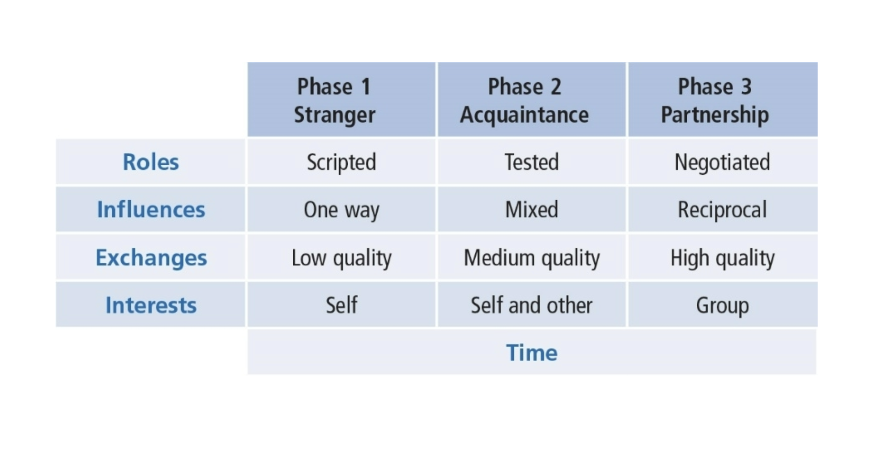

# Leader–Member Exchange Theory

Leader–Member Exchange Theory (LMX) conceptualizes leadership as a process. It is created by the interactions of the leader and their followers.

Some parts of the theory focus on the leaders. Other parts on the followers.

## Table of Contents

- [Dimensions of Leadership](#Dimensions-of-Leadership)
- [LMX Theory Description](#LMX-Theory-Description)
- [Early Studies](#Early-Studies)
- [In-Group and Out-Group Followers](#In-Group-and-Out-Group-Followers)
- [Later Studies](#Later-Studies)
- [Leadership Making](#Leadership-Making)
  - [Phase 1 Stranger](#Phase-1-Stranger)
  - [Phase 2 Acquaintance](#Phase-2-Acquaintance)
  - [Phase 3 Mature Partnership](#Phase-3-Mature-Partnership)
- [How Does LMX Theory Work?](#How-Does-LMX-Theory-Work?)
- [Strengths](#Strengths)
- [Criticisms](#Criticisms)
- [Application](#Application)

## Dimensions of Leadership

LMX theory makes the dyadic relationship between leaders and followers the focal point of the leadership process. A dyadic relationship is one that is two-way.

## LMX Theory Description

LMX theory was first described by Dansereau, Graen, and Haga (1975); Graen and Cashman (1975); and Graen (1976). The theory has undergone a number of revisions since its inception and continues to be of interest to researchers. LMX theory challenges the assumption that leaders treat followers in a collective way, as a group. It directed attention to the idea that a leader might interact with their followers on an individual level.

## Early Studies

The first studies of LMX were called Vertical Dyad Linkage (VDL). The focus was on the vertical linkages leaders formed with each of their followers. A leader’s relationship to a work unit viewed as a series of vertical dyads. The leader forms unique relationship with each follower. Researchers found two general types of linkages (or relationships).

The first was an in-group or one that took on expanded/negotiated role responsibilities. These relationships marked by mutual trust, respect, liking, and reciprocal influence. They receive more information, influence, confidence, and concern than out-group members.

The second was the out-group or one that simply worked according to their formal employment contract (defined-roles). They had relationships marked by formal communication based on job descriptions.

In-group/out-group status based on how well follower works with the leader and how well the leader works with the follower. How followers involve themselves in expanding their role responsibilities with the leader determines whether they become in-group or out-group participants. Becoming part of the in-group involves follower negotiations in performing activities beyond the formal job description.

## In-Group and Out-Group Followers

Studies found that the in-group tended to:

- have more information, influence, confidence, and concern from leader
- be more dependable, highly involved, and communicative than out-group

Whereas the out-group tended to:

- be less compatible with leader
- usually just come to work, do the job, and go home

## Later Studies

Initial research primarily addressed differences between in-groups and out-groups. Later research addressed how LMX theory was related to organizational effectiveness. It focused on the quality of leader–member exchanges resulting in positive outcomes for leaders, followers, groups, and organizations in general.

Researchers found that high-quality leader–member exchanges resulted in:

- Less employee turnover
- More positive performance evaluations
- Higher frequency of promotions
- Greater organizational commitment
- More desirable work assignments
- Better job attitudes
- More attention and support from the leader
- Greater participation
- Faster career progress

A study by Gerstner and Day (1997) found that LMX consistently related to member job performance, overall satisfaction, supervisor satisfaction, commitment, role conflict and clarity, turnover intentions.

The study by Ilies, Nahrang, and Morgeson (2007) found a positive relationship between LMX quality and citizenship behaviors (discretionary employee behaviors that go beyond the prescribed role, job description, or reward system).

In the Hill, Kang, and Seo (2014) study, they found that a greater amount of electronic communication between leaders and followers leads to higher LMX.

## Leadership Making

There is a prescriptive approach to leadership that emphasizes that a leader should develop high-quality exchanges with all of her or his followers, rather than just a few. Leadership making moves through three phases.

1. stranger phase
2. acquaintance phase
3. mature partnership phase

### Phase 1 Stranger

This phase is marked by interactions within the leader–follower dyad that are generally rule bound. They rely on contractual relationships and they relate to each other within prescribed organizational roles. They tend to experience lower quality exchanges. The motives of follower are directed toward self-interest rather than good of the group.

### Phase 2 Acquaintance

This phase begins with an “offer” by leader/follower for improved career-oriented social exchanges. There will be a testing period for both, where each is assessing whether the follower is interested in taking on new roles and the leader is willing to provide new challenges. There is a shift in dyad from formalized interactions to new ways of relating. The quality of exchanges improves along with greater trust and respect. The follower becomes less focused on self-interest and more on the goals of the group.

### Phase 3 Mature Partnership

This phase is marked by high-quality leader–member exchanges. The leader and follower both experience high degree of mutual trust, respect, and obligation toward each other. They have tested relationship and found it dependable. There is a high degree of reciprocity between leaders and subordinates and they may depend on each other for favors and special assistance. There now exists highly developed patterns of relating that produce positive outcomes for both themselves and the organization. Partnerships are transformational--moving beyond self-interest to accomplish greater good of the team and organization.

## How Does LMX Theory Work?

It works in two ways. It describes leadership and it prescribes leadership.

Descriptively, it suggests that it is important to recognize the existence of in-groups and out-groups within an organization. There are significant differences in how goals are accomplished using in-groups versus out-groups. Relevant differences in in-group versus out-group behaviors.

Prescriptively, it is best understood within the Leadership–Making Model. Leader forms special relationships with all followers. Leader should offer each follower an opportunity for new roles/responsibilities. Leader should nurture high-quality exchanges with all followers. Rather than concentrating on differences, leader focuses on ways to build trust and respect with all followers, resulting in entire work group becoming an in-group.

## Strengths

LMX theory validates our experience of how people within organizations relate to one another and the leader. LMX theory is the only leadership approach that makes the dyadic relationship the centerpiece of the leadership process. LMX theory directs our attention to the importance of communication in leadership. There is a solid research foundation on how the practice of LMX theory is related to positive organizational outcomes.

## Criticisms

It inadvertently supports the development of privileged groups in the workplace; appears unfair and discriminatory. The basic theoretical ideas of LMX are not fully developed. There are still questions such as:

- How are high-quality leader–member exchanges created?
- What are the means to achieve building trust, respect, and obligation? What are the guidelines?

Because of various scales and levels of analysis,measurement of leader–member exchanges is being questioned.

## Application

Applicable to all levels of management and different types of organizations. Directs managers to assess their leadership from a relationship perspective. Sensitizes managers to how in-groups and out-groups develop within their work units. Can be used to explain how CEO's strategically develop special relationships with select individuals in upper management. Can be used to explain how individuals create leadership networks at various levels throughout an organization. Can be applied in different types of organizations--volunteer, business, education, and government settings.
