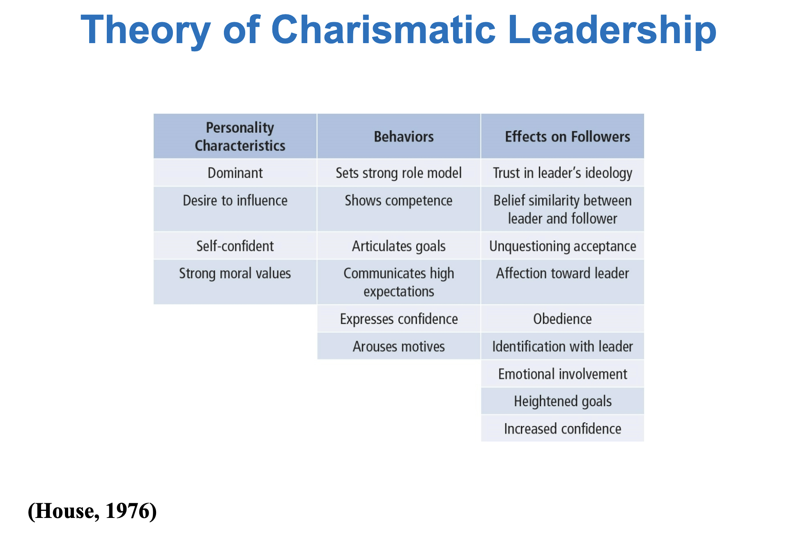

# Transformational Leadership

Transformational Leadership is a process that changes and transforms individuals, both leaders and followers. It involves an exceptional form of influence that moves followers to accomplish more than what is usually expected. It is concerned with emotions, values, ethics, standards, and long-term goals. Transformational Leadership describes a wide range of leadership influence where followers and leaders are bound together in the transformation process.

## Table of Contents

- [Types of Leadership Defined](#Types-of-Leadership-Defined)
  - [Transactional](#Transactional)
  - [Psuedo-Transformational](#Psuedo-Transformational)
  - [Transformational](#Transformational)
- [Transformational Leadership and Charisma](#Transformational-Leadership-and-Charisma)
- [Theory of Charismatic Leadership](#Theory-of-Charismatic-Leadership)
- [Model of Transformational Leadership](#Model-of-Transformational-Leadership)
- [Transformational Leadership Factors: The 4 Is](#Transformational-Leadership-Factors:-The-4-Is)
- [The Additive Effect of Transformational Leadership](#The-Additive-Effect-of-Transformational-Leadership)
- [Transactional Leadership Factors](#Transactional-Leadership-Factors)
- [Non-leadership Factor](#Non-leadership-Factor)
- [Strengths](#Strengths)
- [Criticisms](#Criticisms)
- [Application](#Application)

## Types of Leadership Defined

There are three types of leadership:

- **Transactional**: Focuses on the exchanges that occur between leaders and their followers.
- **Psuedo-Transformational**: Focuses on the leader’s own interests rather than the interests of his or her followers
- **Transformational**: Process of engaging with others to create a connection that increases motivation and morality in both the leader and the follower

### Transactional

This exchange focuses on the exchanges that occur between leaders and their followers. This dimension is so common that you can observe it at all walks of life. For example, no new taxes in exchange for votes, complete goals and get a promotion.

### Psuedo-Transformational

This exchange focuses on the leader’s own interests rather than the interests of his or her followers. Leaders who are transforming but in a negative way. They tend to be self-consumed, exploitive; power-oriented, with warped moral values. Includes leaders like Adolph Hitler or Saddam Hussein. A model of psuedo-transformational leadership can be defined by being:

- Self-serving
- Unwilling to encourage independent thought in followers
- Exhibits little general caring for others
- Uses inspiration and appeal to manipulate followers for his or her own ends

### Transformational

Leader is attentive to the needs and motives of followers and tries to help followers reach their fullest potential. Mohandas Gandhi raised the hopes and demands of millions of his people and in the process was changed himself. Ryan White raised people’s awareness about AIDS.

## Transformational Leadership and Charisma

Charisma was defined in 1947 as a special personality characteristic that gives a person superhuman or exceptional powers and is reserved for a few, is of divine origin, and results in the person being treated as a leader.

In 1976 another theory came about with a better definition: Charismatic leaders act in unique ways that have specific charismatic effects on their followers.

## Theory of Charismatic Leadership

## Model of Transformational Leadership

Expanded and refined version of work done by Burns and House. It included:

- More attention to followers’ rather than leader’s needs
- Suggested TL could apply to outcomes that were not positive
- Described transactional and transformational leadership as a continuum

It also extended House’s work by giving more attention to emotional elements and origins of charisma and suggested charisma is a necessary but not sufficient condition for TL.

TL motivates followers beyond the expected by raising consciousness about the value and importance of specific and idealized goals. It transcends self-interest for the good of the team or organization. It also addresses higher level needs.

## Transformational Leadership Factors: The 4 Is

**Idealized Influence:**

- Acting as strong role models
- High standards of moral and ethical conduct
- Making others want to follow the leader’s vision

**Inspirational Motivation:**

- Communicating high expectations
- Inspiring followers to commitment and engagement in shared vision
- Using symbols and emotional appeals to focus group members to achieve more than self-interest

**Intellectual Stimulation:**

- Stimulating followers to be creative and innovative
- Challenging their own beliefs and valuing those of leader and organization
- Supporting followers to try new approaches
- Supporting followers to develop innovative ways of dealing with organization issues

**Individualized Consideration:**

- Listening carefully to the needs of followers
- Acting as coaches to assist followers in becoming fully actualized
- Helping followers grow through personal challenges
- For example, showing optimism helps employees become more engaged in their work

## The Additive Effect of Transformational Leadership

- Augments impact on employee’s performance and company profit
- Positively related to job satisfaction and performance
- Boosts employee engagement and optimism
- TL leaders more likely to promote employee’s achieving their mastery goals

## Transactional Leadership Factors

The exchange process between leaders and followers in which effort by followers is exchanged for specified rewards. For example, how much TV a child can watch after practicing piano.

Leadership that involves corrective criticism, negative feedback, and negative reinforcement. It can be active where the leader watches follower closely to identify mistakes/rule violations. Or it can be passive where the leader intervenes only after standards have not been met or problems have arisen.

## Non-leadership Factor

This is the Laissez-Faire approach. There is an absence of leadership. This refers to a leader who abdicates responsibility, delays decisions, gives no feedback, and makes little effort to help followers satisfy their needs. This may also be a strategic choice by leader to acknowledge subordinates’ abilities.

## Strengths

TL has been widely researched, including a large body of qualitative research centering on prominent leaders and CEO's in major firms. People are attracted to TL because it makes sense to them. TL treats leadership as a process occurring between followers and leaders. TL provides a broader view of leadership that augments other leadership models. Contributes to leader’s growth. TL emphasizes followers’ needs, values, and morals. Evidence supports that TL is an effective form of leadership.

## Criticisms

Lacks conceptual clarity:

- Dimensions are not clearly delimited
- Parameters of TL overlap with similar conceptualizations of leadership
- Unclear whether dimensions are simply descriptions of TL

Measurement questioned:

- Validity of MLQ not fully established
- Some transformational factors are not unique solely to the transformational model

TL treats leadership more as a personality trait or predisposition than a behavior that can be taught. No causal link shown between transformational leaders and changes in followers or organizations. TL is elitist and antidemocratic. Suffers from heroic leadership bias. Has the potential to be abused. May not be well-received by millennials.

## Application

Provides a general way of thinking about leadership that stresses ideals, inspiration, innovations, and individual concerns. Can be taught to individuals at all levels of the organization. Able to positively impact a firm’s performance. May be used as a tool in recruitment, selection, promotion, and training development. Can be used to improve team development, decision-making groups, quality initiatives, and reorganizations. The MLQ and Sosik and Jung (2010) guide help leaders to target areas of leadership improvement.
