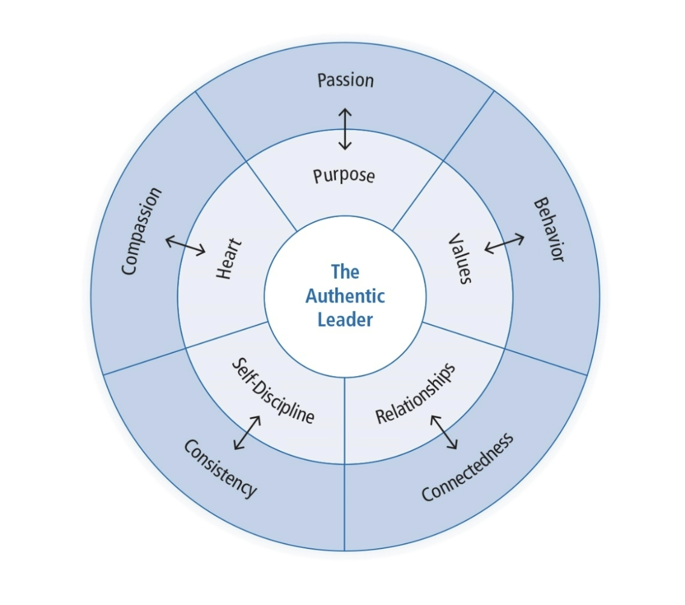

# Authentic Leadership

Authentic Leadership focuses on whether leadership is genuine. Interest in Authentic Leadership has increased on recent years due to social upheavals. People are longing for trustworthy leaders after many corporate scandals. It was identified earlier in transformational leadership research but not studied separately. There needed to be evidence-based research of construct.

## Table of Contents

- [Authentic Leadership Defined](#Authentic-Leadership-Defined)
- [Practical Approaches to Authentic Leadership](#Practical-Approaches-to-Authentic-Leadership)
- [Theoretical Approaches to Authentic Leadership](#Theoretical-Approaches-to-Authentic-Leadership)
- [Definition of Authentic Leadership](#Definition-of-Authentic-Leadership)
- [Basic Model of Authentic Leadership](#Basic-Model-of-Authentic-Leadership)
- [Factors That Influence Authentic Leadership](#Factors-That-Influence-Authentic-Leadership)
- [Strengths](#Strengths)
- [Criticisms](#Criticisms)
- [Application](#Application)

## Authentic Leadership Defined

Intrapersonal Definition:

- Leadership based on self-concept and how self-concept relates to actions (Shamir & Eilam, 2005)
- Relies on the life story of the leader

Interpersonal Definition:

- Leadership is created by leaders and followers together (Eagly, 2005).
- It is a reciprocal process because leaders affect followers and followers affect leaders.

Three Authentic Leadership Characteristics:

- ALs exhibit genuine leadership
- ALs lead from conviction
- ALs are originals, not copies

Developmental Definition:

- Leadership can be nurtured and developed over a lifetime (Avolio & Gardner, 2005)
- Can be triggered by major life events
- Leader behavior is grounded in positive psychological qualities and strong ethics

Four authentic leadership components:

- Self-awareness
- Internalized moral perspective
- Balanced processing
- Relational transparency

## Practical Approaches to Authentic Leadership

Bill George (2003, 2007)

- Leader characteristic model
- Leaders have genuine desire to serve others
- Five characteristics of authentic leaders
  - Understand their purpose
  - Strong values
  - Trusting relationships
  - Self-discipline
  - Act from the heart (mission)

## Theoretical Approaches to Authentic Leadership

There has been a recent flurry of research into this form of leadership. It has been spurred by:

- Leadership summit publications
- Social upheaval and desire for leadership that serves the common good
- Need to explore meaning of authentic leadership and create theoretical framework
- Need to define the construct of authentic leadership

## Definition of Authentic Leadership

> "A pattern that draws upon and promotes both positive psychological capacities and a positive ethical climate, to foster greater self-awareness, an internalized moral perspective, balanced processing of information, and relational transparency on the part of leaders working with followers, fostering positive self-development.”

-Walumbwa, Avolio, Gardner, Wernsing, and Peterson (2008)

## Basic Model of Authentic Leadership

Four Components:

- Self-awareness
  - Reflecting on one’s core values, identity, emotions, motives
  - Being aware of and trusting one’s own feelings
- Internalized moral perspective
  - Self-regulatory process using internal moral standards to guide behavior
- Balanced processing
  - Ability to analyze information objectively and explore other people’s opinions before making a decision
- Relational transparency
  - Being open and honest in presenting one’s true self to others

## Factors That Influence Authentic Leadership

Positive psychological capacities

- Confidence
- Hope
- Optimism
- Resilience

Moral Reasoning Capacities

- Deciding right and wrong
- Promoting justice, greater good of the organization or community

Critical Life Events

- Act as a catalyst for change
- People attach insights to their life experiences
- When people tell life stories they gain clarity about who they are
- Stimulate personal growth

## Strengths

Fulfills society’s expressed need for trustworthy leadership. Fills a void in an uncertain world. Provides broad guidelines for those who want to become authentic leaders. Both practical and theoretical approaches provide a map. Like transformational and servant leadership, AL has an explicit moral dimension; focus on collective good. Unlike traits that only some people exhibit, everyone can learn to be more authentic. Can be measured using an established instrument (ALQ).

## Criticisms

The theory is still in the formative stages, so some concepts in the practical approaches are not fully developed or substantiated. The moral component of AL is not fully explained. It’s unclear how higher values such as justice inform authentic leadership. The rationale for including positive psychological capacities as a part of AL has not been clearly explained by researchers. New research is needed to determine if AL works well with Millennial generation. The link between authentic leadership and positive organizational outcomes is unclear. It is also not clear whether AL is sufficient to achieve organizational goals.

## Application

People have the capacity to become authentic leaders. It is a lifelong learning process. Human resource departments may be able to foster authentic leadership behaviors in employees who move into leadership positions. Leaders are always trying to do the “right” thing, to be honest with themselves and others, and to work for the common good. Leaders are shaped by critical life events that lead to growth and greater authenticity.
